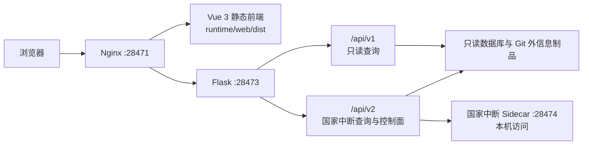

# Domeye Core 前后端总览

## 文档性质

本文是当前仓库架构说明，依据同一提交中的机器合同和实际注册代码整理。它不记录
某次候选或历史验收结果，也不声明某个 release 当前正在生产运行。生产身份必须
通过 [`deploy/inventory/collect-production-runtime.py`](../deploy/inventory/collect-production-runtime.py)
在目标机器上实时采集。

## 系统定位与能力边界

Domeye Core 是 BGP 路由异常检测核心的精简工作台。它把冻结的离线检测实现、
固定历史数据查询、事件证据、国家中断发布快照和事件限定的报告控制面组织在一个
可独立部署的系统中。

系统能够说明的是固定观测范围内的 BGP 控制面事实，例如路由可见性、报文活动、
固定 cohort 的 ASN 状态和已发布证据身份。它不能仅凭这些数据证明：

- 用户能否访问互联网；
- 业务服务是否中断以及损失规模；
- 事件原因、责任主体或恢复原因；
- 控制面变化与数据平面影响之间的直接比例；
- 当前系统已经具备实时全网 RCA 或自动处置闭环。

国家中断观测和报告边界固定为 RRC25。报告模型负责受约束叙述，不负责计算或改变
检测事实。

## 组件关系



Nginx 同时服务静态前端并反向代理 `/api/v1`、`/api/v2`。Vue 不直接连接数据库
或 Sidecar。Flask 负责查询、发布身份校验、请求边界、认证上下文和 Sidecar 代理。
Sidecar 只接受本机控制面调用。

## `/api/v1` 与 `/api/v2`

| 前缀 | 主要职责 | 方法语义 |
| --- | --- | --- |
| `/api/v1` | 健康、P0、事件、详情、证据、特征和仪表盘 | 当前注册接口均为只读 `GET` |
| `/api/v2` | 国家中断引用解析、总览、时序、ASN、审计与报告控制面 | 查询使用 `GET`；报告、追问和终止使用受约束 `POST` |

`POST` 控制面只创建或终止短生命周期的 Agent 运行，不修改数据库中的检测结果。
完整方法和路径见[后端 API 表](../backend/README.md#api-职责)，机器合同见
[`contracts/openapi.json`](../contracts/openapi.json)。

## 页面路由

| 页面 | 路径 | 作用 |
| --- | --- | --- |
| 核心态势 | `/` | 固定窗口数据身份、覆盖和摘要 |
| 异常事件 | `/events` | 六类异常分页、过滤和详情入口 |
| 事件证据 | `/events/detail` | 通用证据或国家中断工作台 |
| 综合特征 | `/features` | 全局、国家或 ASN 的时序特征 |
| 国家态势 | `/countries`、`/countries/:country` | 国家定位和档案 |
| ASN 态势 | `/ases`、`/ases/:asn` | ASN 定位和档案 |

开发模式另有 `/__components` 组件标本页。完整注册表及兜底路由见
[前端说明](../frontend/README.md#页面路由)和
[`frontend/src/router/index.ts`](../frontend/src/router/index.ts)。

## 数据档、窗口与 RRC25

权威数据档为 `feb-mar-2026`，来自
[`config/data-profile.json`](../config/data-profile.json)：

| 字段 | 值 |
| --- | --- |
| 模式 | `fixed` |
| 时区 | `Asia/Shanghai` |
| 起点 | `2026-02-01T00:00:00+08:00` |
| 终点（不含） | `2026-04-01T00:00:00+08:00` |
| 快照时刻 | `2026-03-31T23:59:59+08:00` |

页面展示范围对应 2026-02-01 至 2026-03-31。Vite 构建、开发工具和后端数据门禁
必须读取或验证同一配置，不能各自维护另一套日期。

国家中断发布快照还冻结：

- `incident_id`；
- `publication_id`；
- `revision`；
- `data_through`；
- `collector = rrc25`；
- 观察窗口和固定 cohort；
- 数据最终性与质量身份。

## 国家中断观测、报告、追问和下载

国家中断详情页分成两个视图：

1. 数据观测：总览、地址族时序、更新活动、ASN 矩阵和审计；
2. 报告与追问：围绕当前发布快照生成报告、订阅进度、追问、终止和下载。

报告控制面支持：

- 创建事件限定报告；
- SSE 状态和断线重连；
- 在同一快照上追问；
- 取消当前运行；
- Markdown 与 PDF 下载；
- 在显式授权且能力就绪时生成外部附录。

外部证据 Provider 未配置时，能力状态应明确为不可用，不得让模型或后端绕过网络
边界。Domeye 内部报告与追问不依赖外部证据才能成立。详细运行约束见
[`deploy/country-outage-agent/README.md`](../deploy/country-outage-agent/README.md)。

## 五种容易混淆的状态

| 状态 | 依据 | 可以声称 | 不可以声称 |
| --- | --- | --- | --- |
| 本地开发 | Worktree、分支、基线、差异 | 本地实现或测试结果 | 已合并、已发布 |
| 候选验收 | 候选制品、Canary、定向测试 | 候选满足指定合同 | 生产已切换 |
| Git 闭包 | 提交、远端分支、标签 | 源码身份可回读 | 运行时正在使用 |
| 源码发布 | 不可变归档、组件 manifest、树哈希 | 制品与源码绑定 | Nginx 和进程已指向 |
| 生产运行 | 实时端口、PID、`cwd`、release、前端树、Nginx、回滚状态 | 采集时刻的运行身份 | 未来持续状态 |

健康接口、Hook、测试数量、构建成功、候选截图或历史验收文档都只能覆盖各自
合同，不能独立升级为生产结论。

## 前端原子安装与回滚

前端安装目标与 Nginx root 必须同为：

```text
/home/bgpdata/Domeye-Core-runtime/web/dist
```

安装器先验证候选树、复制到目标同级临时目录、复算确定性哈希，再通过同文件系统
重命名切换整个目录。状态目录保存 `frontend-current`、安装状态、回滚 journal 和
上一前端目录。

局部页面更新不能直接带入来源不明的完整 `dist`。整体切换后必须重新打开
`/events` 等关键页面，验证固定日期、真实 API 请求和结果，并回读在线入口资源与
前端树。详细过程见[部署说明](../deploy/README.md#前端原子安装)。

## 生产身份确认

生产状态必须通过实时库存证据确认，不能仅凭分支名、标签、目录名或 HTTP 200
判断。在目标机器仓库根目录执行：

```bash
python3 -B deploy/inventory/collect-production-runtime.py
```

库存采集器不联网、不访问数据库、不读取进程环境、`.env`、认证或密钥，也不执行
切换。它将进程、端口、release、核心哈希、Nginx、前端树、依赖和服务器 Git
引用放入同一份带 SHA-256 的 JSON。历史验收记录不得作为当前生产运行身份依据。
