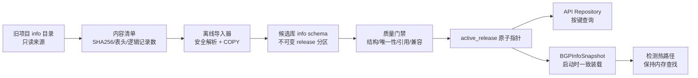

# `backend/info` 数据落库设计

## 1. 结论

建议把 `/home/bgpdata/Domeye/backend/info` 作为**只读来源**，离线导入 Domeye-Core 自己的 PostgreSQL 12/TimescaleDB 候选库；不要写旧目录、不要连接旧生产库作为运行时依赖，也不要把 24 个文件简单塞成 24 个大 JSON/`bytea`。

目标形态是：

1. 一套不可变、带内容哈希和质量证据的 `info` 数据快照；
2. 面向 API 的索引化关系表；
3. 面向检测器的一次性一致快照装载器；
4. 通过一个版本指针原子切换全部静态信息；
5. 旧文件读取保留为可回滚后端，经过影子对账后再下线。

现有代码定义的 `public.as_info` 只有 8 列，且已标注“弃用”；启动只建表而不导入。它无法承载完整数据，也不应通过不断 `ALTER TABLE` 演化成本次模型。

配套的逐文件分析见 [INFO目录数据文件用途清单](INFO目录数据文件用途清单.md)。

## 2. 设计依据与已发现问题

### 2.1 数据和调用链事实

- 真实目录有 24 个数据文件，约 5.44 GiB。
- 当前 Domeye-Core 四文件制品只包含 `as_entity.csv`、`important_as.csv`、`ip_bgp_entity.csv`、`country.xlsx`；它覆盖精简 API，但不覆盖旧检测器使用的全部静态数据。
- 旧 API 把 AS、prefix、国家和域名数据加载成长驻 Python 字典；两份域名文件合计约 2.66 GiB，首次延迟加载会产生明显的 I/O、解析和内存尖峰。
- `BGPInfo` 在检测器启动时一次读取 AS 关系、pfx2as、三元组等数据；检测热路径随后大量做字典查找，不能机械地替换为“每条 update 发一条 SQL”。
- 静态数据会影响检测过滤和分级，必须把一次检测运行绑定到一个明确的 info release。

### 2.2 当前实现风险

1. **来源不可追溯**：文件缺少统一生成时间、生产者、输入版本和内容级 release。
2. **非原子更新**：逐个替换文件可能让 AS、关系、prefix、域名和三元组来自不同批次。
3. **不安全解析**：多个消费者对 CSV 中的字符串化列表使用 `eval()`，来源文件一旦被篡改可导致代码执行。
4. **错误计数口径**：当前信息制品用“CSV 物理行数减表头”计数。`ip_bgp_entity.csv` 已实测物理数据行 1,363,337、逻辑记录 1,357,067，两者相差 6,270。
5. **无效键被静默接纳**：两个重要 prefix Excel 各有 1 条空 prefix；`domain_cn.csv` 有 2 条空 URL；`country.xlsx` 有缺少两位代码和坐标的行。
6. **规范化可能改变行为**：`ip_bgp_entity.csv` 有 11 个可解析但非规范形式的 prefix。若直接转成 `cidr` 并以规范值去重，会改变旧代码的精确字符串键语义。
7. **隐式优先级**：域名冲突时 `website_entity.csv` 胜出；多类字典按源文件第一条胜出；`ases_1000` 是文件前 1000 行而不是显式按 rank 排序。
8. **旧/新文件并存**：关系、私有 AS、三元组和 AS 字典均有不同版本，不能根据文件名猜测“新的一定正确”。
9. **现有发布门禁不接受静态表**：`prune.sql` 会删除除事件/特征表外的 public 表，`validate-integrity.sql` 拒绝任何额外用户 schema，`inventory.sql` 假定所有 public 表都有 `t` 或 `s_time`。落库必须同步修改发布合同。

## 3. 总体架构



边界原则：

- 源目录永远只读；
- 导入只发生在离线候选库，不在在线只读数据库执行；
- PostgreSQL 是服务真值源，原始文件/归档仍是审计和灾备来源；
- 数据库只保存结构化记录和来源证据，不保存整文件 `bytea`；
- 全部业务表使用同一个 `release_sk`，禁止按表独立激活。

## 4. Schema 与版本模型

### 4.1 使用单独的 `info` schema

选择 `info` schema，而不是扩展 `public.as_info`：

- 避免与已有事件/特征表和弃用表冲突；
- 权限、备份、清理和容量统计可单独控制；
- 允许显式维护一份静态信息表白名单；
- 便于后续按 release 分区和整体回收。

当前发布门禁禁止非 public 用户 schema，因此该选择必须伴随第 11 节的发布合同改造；不能只建表不改门禁。

### 4.2 release 身份

`info.dataset_release` 同时使用内部和外部身份：

| 字段 | 类型 | 说明 |
| --- | --- | --- |
| `release_sk` | `bigint identity` | 大表引用的紧凑内部键 |
| `content_id` | `text unique` | `info_v1_` + 规范 manifest SHA256 前 32 位 |
| `manifest_sha256` | `char(64) unique` | 24 个文件名、大小、SHA256、解析器版本和配置哈希的规范清单哈希 |
| `source_release_label` | `text` | 和外层 Domeye release-id 绑定，但不参与内容身份 |
| `status` | enum/check | `loading/validating/ready/active/retired/failed` |
| `parser_version`、`code_commit` | `text` | 解析逻辑血缘 |
| `created_at`、`activated_at` | `timestamptz` | 机器时间统一 UTC |
| `quality_summary` | `jsonb` | 门禁摘要，明细另表保存 |

`info.active_release` 每个 profile 只有一行：

```text
profile_name PK
release_sk FK
previous_release_sk FK
activated_at
activated_by
activation_reason
```

生产 profile 使用 `core`。激活只更新这一行，并要求目标 release 已为 `ready`。外层数据库制品激活时，数据库 manifest 必须记录 `content_id` 和 `manifest_sha256`。

### 4.3 来源与导入元数据

| 表 | 作用 |
| --- | --- |
| `info.source_file` | 文件名、格式、大小、SHA256、mtime、表头哈希、物理行数、逻辑记录数、source priority、active/legacy 角色 |
| `info.import_run` | 幂等键、状态机、起止时间、导入器版本、每阶段检查点、错误摘要 |
| `info.quality_result` | `rule_id/rule_version/status/observed/expected/evidence_ref` |
| `info.quarantine` | 文件、逻辑记录号、自然键、原因码、原始记录哈希和受限 payload |

`UNIQUE(manifest_sha256, parser_version, importer_config_sha256)` 作为导入幂等键。失败重跑必须续用同一 run 或创建明确的新 attempt，不能猜测上一轮是否写完。

## 5. 业务表模型

所有业务表都含：

```text
release_sk       bigint not null
source_file_sk   bigint not null
source_row_no    bigint not null
source_record_sha256 char(64) not null
```

外部 ASN 使用 `bigint` 并约束 `0 <= asn <= 4294967295`；API 边界再转字符串。prefix 同时保留 `prefix_raw text` 和 `prefix_cidr cidr`，避免静默改变旧字符串键。

### 5.1 AS、组织和国家

| 表 | 主键/唯一键 | 关键字段 | 来源 |
| --- | --- | --- | --- |
| `info.country` | `(release_sk, country_sk)`；合法 alpha-2 唯一 | 中英文名、alpha-2/3、数字码、电话码、时差、经纬度、质量状态 | `country.xlsx` |
| `info.country_alias` | `(release_sk, alias_kind, alias_value)` | 统一指向 `country_sk` | `country.xlsx` |
| `info.autonomous_system` | `(release_sk, asn)` | 名称、国家、组织、类型、描述、反 DDoS、排名、Peer/Prefix 统计、源行序 | `as_entity.csv` |
| `info.as_contact` | `(release_sk, asn, contact_kind, ordinal)` | 安全解析后的 JSONB；和普通实体权限分离 | `as_entity.csv` |
| `info.as_policy_member` | `(release_sk, asn, direction, token, ordinal)` | `import/export` 原 token、可解析 ASN | `as_entity.csv` |
| `info.as_relation` | `(release_sk, source_asn, target_asn, relation_kind, afi, source_file_sk)` | provider/customer/peer/sibling/upstream/downstream、来源字段、ordinal、active source 标志 | `as_rel_dict*`、`as_entity.csv` |
| `info.mapping_record` | `(release_sk, source_file_sk, source_row_no)` | 映射顶层键、子项数和 active source 标志；显式保留“键存在但映射为空” | `pfx2as_dict.txt`、`as_rel_dict*`、两版 private AS JSON |
| `info.important_as` | `(release_sk, asn)` | 标签、来源名称 | `important_as.csv` |
| `info.as_rank` | `(release_sk, source_file_sk, asn)` | rank、国家、组织、名称、类型 | `as_rank.json`、`as_entity.csv` |
| `info.organization` | `(release_sk, source_file_sk, org_key)` | 组织名称、国家、统计字段 | `org_entity.csv` |
| `info.organization_as` | 复合键 | 组织与 sibling ASN 关联 | `org_entity.csv` |
| `info.organization_prefix` | 复合键 | 组织与 v4/v6 prefix 关联 | `org_entity.csv` |

`as_contact` 默认不授予分析只读角色；只给确实需要生成事件详情/报告的服务角色，并禁止在日志和质量报告中输出原文。

### 5.2 Prefix、Origin 和域名

| 表 | 主键/唯一键 | 关键字段 | 来源 |
| --- | --- | --- | --- |
| `info.prefix` | `(release_sk, prefix_raw)` | `prefix_cidr`、规范化状态、名称、描述、route 原文、BGP 值、组织/国家/来源、声明域名数量 | `ip_bgp_entity.csv` |
| `info.prefix_origin` | 复合键 | prefix、ASN、关系来源 `route/bgp/pfx2as`、`source_value`、ordinal | `ip_bgp_entity.csv`、`pfx2as_dict.txt` |
| `info.as_prefix_history` | `(release_sk, source_file_sk, asn, prefix_raw)` | `prefix_cidr`、未解释的 `source_value` | `pfx2as_dict.txt` |
| `info.important_prefix` | 复合键 | prefix、AFI、number、host、质量状态 | `ipv4_all_prefix.xls`、`ipv6_all_prefix.xls` |
| `info.domain_record` | `(release_sk, source_file_sk, source_row_no)` | 原始 URL 键、显式规范化版本、标题、行业、描述、位置、source priority | `website_entity.csv`、`domain_cn.csv` |
| `info.domain_address` | 复合键 | 域名、角色 `resolved/authoritative`、IP/前缀、ordinal | 两个域名 CSV |
| `info.prefix_domain` | 复合键 | prefix、域名、角色 `normal/authoritative`、ordinal | `ip_bgp_entity.csv` |
| `info.important_domain` | `(release_sk, domain_key)` | 名称、IP 列表 | `domain_cn_center.txt` |

域名兼容视图必须按：

```text
source_priority: website_entity.csv < domain_cn.csv
然后按 source_row_no
```

选择第一条，保持旧 `concat + drop_duplicates(keep='first')` 行为。域名键不能在第一版中擅自做 IDNA、去尾点或 scheme 重写；应保留 `domain_key_raw`，另存带版本的规范键供新查询使用。

### 5.3 检测先验和历史数据

| 表 | 主键/唯一键 | 关键字段 | 来源 |
| --- | --- | --- | --- |
| `info.private_as_location` | 复合键 | public ASN、private ASN、`ip_num`、city、source active 标志 | 两版 private AS JSON |
| `info.route_triplet_baseline` | 复合键 | 三个 ASN、`appear_time_raw`、`appear_num`、`stability numeric`、`is_leak`、source active 标志 | 两版三元组 CSV |
| `info.dns_observation` | 复合键 | dataset kind、domain、IP、原索引 | `top_nx.csv`、`top_ip.txt` |
| `info.legacy_record` | `(release_sk, source_file_sk, natural_key, source_row_no)` | 每个 ASN/行一条 JSONB、payload hash | `as_dict.txt`、`as_dict_new.txt`、`ases_cn.csv`、独立 DDoS 标记等 |

历史/替代文件必须入库保真，但 `info.current_*` 视图只选择 `source_file.role='active'` 的来源。提升旧文件为当前来源必须产生新的 manifest 和 release，不能直接改 role。

### 5.4 分区

以下大表按 `release_sk` 做 LIST 分区：

- `domain_record`
- `domain_address`
- `prefix`
- `prefix_domain`
- `as_prefix_history`
- `as_relation`
- `route_triplet_baseline`
- `dns_observation`
- `legacy_record`

每个 release 在候选库创建独立分区，完成验证后才允许激活。保留当前和上一 release；更老 release 先从 active/previous 引用中解除，再由独立 GC 命令删除。

## 6. 索引设计

只建立真实查询需要的索引，避免给 5 百万域名行和历史表盲目全列建索引。

| 查询 | 索引 |
| --- | --- |
| ASN 精确查询 | `autonomous_system(release_sk, asn)` 主键 |
| 国家下 ASN | `(release_sk, country_code, asn)` |
| rank 前 N | `(release_sk, global_rank, asn) WHERE global_rank IS NOT NULL` |
| prefix 精确键 | `prefix(release_sk, prefix_raw)` 主键 |
| IP 最长前缀匹配 | GiST `(prefix_cidr inet_ops)`，并带 release 过滤 |
| ASN -> prefix | `as_prefix_history(release_sk, asn, prefix_cidr)` |
| prefix -> origin | `prefix_origin(release_sk, prefix_raw, asn)` |
| 域名精确查询和首条优先 | `(release_sk, domain_key_raw, source_priority, source_row_no)` |
| IP -> 域名 | `(release_sk, ip)`；只有接口确有反查需求时启用 |
| AS 关系 | `(release_sk, source_asn, relation_kind, target_asn)` |
| 三元组阈值 | `(release_sk, first_as, second_as, third_as) INCLUDE (stability)` |
| 私有 AS 城市 | `(release_sk, public_asn, private_asn)` |

历史 `legacy_record` 默认只建 `(release_sk, source_file_sk, natural_key)`，不对 JSONB 建 GIN。

导入完成后在候选库执行 `VACUUM (ANALYZE, FREEZE)`；静态分区不做频繁 UPDATE，不需要 Timescale hypertable。

## 7. 安全、确定性的导入流程

### 7.1 状态机

```text
created
  -> manifest_verified
  -> loading
  -> structurally_valid
  -> semantically_valid
  -> compatibility_valid
  -> ready
  -> active
```

任一步失败进入 `failed`，保留 run、staging 分区、计数和错误证据供续跑；不得自动删除现场后重建。

### 7.2 步骤

1. **冻结来源清单**  
   要求实际目录、禁止软链接；记录 24 个白名单文件的大小、SHA256、mtime、格式、表头和逻辑记录数。SHA256 计算前后都复核 inode、大小和 mtime，避免读取中被替换。
2. **生成内容身份**  
   对规范 manifest 计算 SHA256；同一内容和解析器配置重复导入直接复用。
3. **创建 release 分区**  
   使用普通 logged 表；可用 unlogged staging，但只有经过 `INSERT ... SELECT`/COPY 进入 logged 最终分区后才算完成。
4. **流式解析**  
   CSV 使用标准解析器按逻辑记录计数；Excel 先校验文件魔数，再对 OOXML
   使用 `openpyxl(read_only=True)`、对真正 OLE2 XLS 使用
   `xlrd(on_demand=True)`。这可安全处理 `ipv4_all_prefix.xls`、
   `ipv6_all_prefix.xls` 两个“后缀为 `.xls`、内容实际为 OOXML”的历史文件。
   大 JSON 使用流式解析器逐顶层键处理。禁止一次把 2.7 GiB 域名文件或
   350 MiB JSON 读成单个 Python 对象。
5. **安全转换**  
   字符串化列表使用 `ast.literal_eval` 或严格 JSON 解析，并校验最终类型；完全移除 `eval()`。
   文本编码同样属于逐文件合同：默认严格按 `utf-8-sig` 解码，仅经全文件
   验证的历史 `ases_cn.csv` 使用 `gb18030`；禁止替换、忽略非法字节或自动
   猜测编码。
6. **批量 COPY**  
   使用 `COPY FROM STDIN`，建议每 50,000～200,000 行形成一个可计数批次；禁止逐行 commit 和 `executemany` 作为主导入路径。
7. **建立索引和约束**  
   数据装载后建立二级索引；跨表外键可先 `NOT VALID`，完成后显式 `VALIDATE CONSTRAINT`。
8. **质量与兼容门禁**  
   全部通过才将 release 标为 `ready`。
9. **候选激活**  
   离线候选库先设置 `active_release`，随后进入现有 PGDATA 制品验收和外层原子激活。

### 7.3 重复和冲突策略

- 原始层永远保留每条逻辑记录及 `source_row_no`。
- 当前兼容视图按旧代码的来源顺序和“第一条胜出”规则选择。
- 自然键冲突要写入质量结果；不能依赖 PostgreSQL 无序 `DISTINCT`。
- 无效自然键进入 quarantine，不映射成“未知”实体。
- 非规范 prefix 同时保留 raw 和 canonical；多个 raw 值归一到同一 CIDR 时生成 collision 证据，第一版仍按 raw 键兼容。

## 8. 数据质量门禁

### 8.1 阻断规则

1. 24 文件白名单、普通文件类型、大小和 SHA256 完全一致；
2. 表头/JSON 结构与版本化合同一致；
3. JSON 无重复键，CSV 每条逻辑记录可解析；
4. ASN 为合法 32 位无符号范围；
5. 当前 active 来源的自然键唯一或有确定的 first-wins 证据；
6. active AS 关系满足：
   - `peer == peers` 或明确版本差异；
   - provider/customer 反向闭合；
7. `source_file` 逻辑记录数和最终 `loaded + quarantined` 完全对账；
8. 每张最终表的 release_sk 都相同，且没有引用 loading/failed release；
9. 数据库只读角色可 SELECT、不能 INSERT/DDL；
10. 影子检测对账未通过时禁止切换检测器。

### 8.2 非阻断但必须显式披露

- prefix 可解析但非规范；
- ASN 关系目标不在 `as_entity.csv`；
- 域名声明数量和展开列表数量不一致；
- 国家缺少代码或坐标；
- 历史/替代文件和当前文件内容差异；
- `pfx2as` 内部数值、`top_nx/top_ip` 生成语义未确认。

### 8.3 当前基线样例

| 检查 | 当前观测 |
| --- | ---: |
| `as_entity.csv` | 133,117 条；ASN 空值 0、重复 0、非法 0 |
| `important_as.csv` | 1,420 条；空值 0、重复 0、非法 0 |
| `ip_bgp_entity.csv` | 1,357,067 条；prefix 空值 0、重复 0、不可解析 0、非规范 11 |
| `ipv4_all_prefix.xls` | 86,489 条；空 prefix 1 |
| `ipv6_all_prefix.xls` | 3,300 条；空 prefix 1 |
| `domain_cn.csv` | 71,353 条逻辑记录；空 URL 2 |
| `as_rel_dict.txt` | 77,787 个 ASN；`peer == peers`；provider/customer 反向闭合 |
| `pfx2as_dict.txt` | 74,417 个 ASN、1,040,413 个关联 |
| `private_as_dict_new.json` | 3 个公网 ASN、1,087 个私网 ASN 关联 |

这些值应写进首个 manifest 的基线证据，但后续版本只以内容哈希和合同校验为准，不能把当前数量硬编码成永久常量。

## 9. 读取层设计

### 9.1 API/Service

新增 `InfoRepository`，接口至少包括：

```text
get_as(asn)
get_as_contacts(asn)
list_top_ases(limit, country)
get_country(alias)
get_prefix_exact(prefix_raw)
longest_prefix_match(ip)
get_prefix_origins(prefix)
get_domain(domain_key)
get_as_prefixes(asn)
is_important_as(asn)
```

API 不再 import 全局大字典。每次请求从连接池读取当前 release；进程内只缓存 `active_release` 和小型国家/重要 AS 数据，缓存键必须含 `release_sk`。

### 9.2 核心检测器

当前仓库约定不允许在迁移阶段修改 `backend/core/` 的业务逻辑。因此检测器切换必须分成两步：

1. 首个落库 release 只切 API/Service；核心检测继续读取与该 `content_id` 绑定、哈希已验证的文件制品。
2. 数据库快照装载器验证完成后，再单独评审一次“数据提供者注入”变更。该变更只能替换 `BGPInfo` 的数据来源，不得改变劫持、泄露、中断算法；必须重新冻结 `core.sha256` 并做固定输入 A/B，不能用更新哈希掩盖业务漂移。

检测热路径继续使用内存快照，但来源改为数据库：

1. 启动 `REPEATABLE READ, READ ONLY` 事务；
2. 读取一次 `active_release`；
3. 用 server-side cursor 分批构建与旧 `BGPInfo` 兼容的只读映射；
4. 提交事务后将 `content_id` 固定到本次检测运行；
5. 运行中即使 active release 改变，也不热切换；
6. 只在检测进程重启或明确的 RIB/update 文件边界加载新快照。

禁止把 AS 关系、三元组和 prefix 查询改成逐 update SQL，否则数据库 RTT 会进入最热循环。

事件和检测运行元数据应增加 `info_content_id`；至少在运行日志和导入证据中保存，后续才能解释“相同 BGP 输入为什么得到不同事件”。

### 9.3 兼容后端

配置建议：

```text
INFO_BACKEND=file | shadow | database
```

- `file`：现有行为；
- `shadow`：文件结果对外，数据库并行读取并记录差异；
- `database`：数据库结果对外，文件仍可用于紧急回滚。

影子模式不得把联系人原文或整行数据写入日志，只记录键、字段名、双方哈希和差异原因。

## 10. 迁移、激活与回滚

### 阶段 0：审计和合同冻结

- 冻结 24 文件清单、字段合同、解析器版本和 source priority；
- 补齐用途不明文件的生产者/时间范围；未补齐者只能进 legacy/raw；
- 记录现有文件加载时长、峰值 RSS 和关键 API 延迟作为性能基线。

### 阶段 1：旁路导入

- 在独立候选 PGDATA 创建 `info` schema；
- 导入全部 active 和 legacy 文件；
- 不修改旧目录，不切换任何消费者。

### 阶段 2：影子读取

- API 做确定性键样本对账；
- 对 active 数据做计数、集合哈希和字段哈希对账；
- 在固定 RIB + update 样本上运行文件/数据库两套 `BGPInfoSnapshot`。

### 阶段 3：分层切换

1. 先切换 API 精确查询；
2. 再切换域名和 longest-prefix-match；
3. 最后在 RIB/update 安全边界重启检测器并切换数据库快照；
4. 观察至少一个约定周期后，停止运行时文件读取。

### 阶段 4：收口

- 保留上一 info release 和四文件制品作为回滚材料；
- 确认无回滚后再由独立 GC 清理更旧分区；
- 不删除原始来源，除非已有独立、哈希校验的不可变归档且获得明确授权。

### 回滚

回滚不做逆向 UPDATE：

1. API 配置切回 `file`，或把 `active_release` 指回 `previous_release_sk`；
2. 检测器在安全边界停止并用上一快照重启；
3. 若是外层数据库制品问题，沿用现有 PGDATA/前端/INFO_DIR 联动回滚；
4. 失败 release 和证据保留，不覆盖、不删除。

## 11. 现有发布流水线必须修改的地方

本设计不是单纯新增 DDL。至少要同步调整：

1. **`deploy/database/sql/prune.sql`**  
   只裁剪 public 事件/特征表；显式保留唯一允许的 `info` schema，拒绝其他用户 schema。
2. **`deploy/database/sql/validate-integrity.sql`**  
   预期表从单列 `table_name` 升级为 `(schema_name, table_name, role, time_column)`；精确允许 `info` 白名单，继续拒绝其他额外表。
3. **`deploy/database/sql/inventory.sql`**  
   遍历 public + info 白名单；静态表的 `min_time/max_time` 为 null，记录 row_count、schema hash、release content ID 和 manifest hash。
4. **`deploy/database/sql/create-reader.sql`**  
   给应用角色授予 `USAGE ON SCHEMA info` 和指定表/视图 SELECT；联系人表单独授权；设置默认权限。
5. **开发库 prune/verify**  
   `dev/database/prune-feb-mar.sql` 和 `verify-feb-mar.sql` 必须识别 info schema，验证 info release 与数据库 release-id 一致。
6. **数据库 artifact manifest**  
   增加 `static_info` 节点，至少含 content ID、manifest SHA256、文件数、active/legacy 记录数、quality gate 版本。
7. **四文件 info artifact**  
   迁移期继续构建和验收，作为影子对账和回滚依赖；数据库模式稳定后再单独提案移除，不能在同一变更中直接删掉。

正确的候选构建顺序是：

```text
恢复/裁剪事件库
-> 创建 info schema
-> 导入静态 info release
-> 全库质量与引用校验
-> 创建只读权限
-> inventory/schema dump
-> 数据库制品打包
-> 候选 API/检测冒烟
```

## 12. 验收标准

### 12.1 数据

- `loaded + quarantined == manifest.logical_record_count`，逐文件成立；
- 所有 active 自然键集合与文件兼容视图一致；
- first-wins 顺序、键类型和空值语义有自动化测试；
- 非规范/无效记录不静默丢失，均有 quarantine 或 collision 证据；
- 任意业务行可追溯到 `source_file_sk + source_row_no + source_record_sha256`。

### 12.2 行为

- ASN、prefix、国家、域名的确定性样本字段哈希 100% 对账；
- AS 关系、pfx2as、私有 AS、三元组映射集合哈希 100% 对账；
- 固定 BGP 样本的六类事件数量、自然键、过滤原因、风险级别和关键描述对账；
- 对批准隔离的空键/非规范键差异单列，不用平均通过率掩盖。

### 12.3 性能

- API 本地数据库精确查询：预热后 p95 不高于 20 ms、p99 不高于 50 ms；
- longest-prefix-match：预热后 p95 不高于 30 ms；
- 不允许请求路径触发全表加载；
- `BGPInfoSnapshot` 装载时间和峰值 RSS 不得比文件基线恶化超过 10%，检测每条 update 的吞吐不得下降超过 5%；
- 首次导入必须记录 COPY、建索引、校验、VACUUM 各阶段耗时和磁盘峰值。

### 12.4 安全与运维

- 运行角色默认事务只读、无建表/写入权限；
- 联系人表最小授权；
- 日志、quality evidence 和 shadow diff 不含联系人原文；
- active release 只能由发布角色修改；
- 激活、回滚、GC 均使用独立命令，普通 `check-*` 无生产副作用。

## 13. 容量预算

源数据约 5.44 GiB，但关系化后会同时存在行头、TOAST、索引、当前/上一 release、staging 和 WAL。首轮不能按 5.44 GiB 预留。

建议在实测前按下列保守预算准备：

- 单 release 表数据和必要索引：约 12～25 GiB；
- 当前 + 上一 release：约 24～50 GiB；
- staging、建索引临时空间和 WAL：额外 25～40 GiB；
- 首次完整导入可用空间：至少 80 GiB。

最终预算必须以候选库 `pg_total_relation_size`、WAL 峰值和两版本共存实测替换，不把本估算写死到发布脚本。

## 14. 推荐实施顺序

1. 先实现 manifest、逻辑记录计数和质量探针；
2. 再实现 AS/国家/prefix/重要 AS 四文件入库与 API shadow；
3. 接着迁移域名和 pfx2as，解决最大内存收益；
4. 再迁移 AS 关系、三元组、私有 AS，并完成检测 A/B；
5. 最后导入用途不明和历史文件，补齐全目录审计；
6. 通过完整候选验收后才切生产，不在在线库手工建表或直接 COPY。

## 15. 当前执行状态（2026-07-24）

本设计已开始执行。S1“完整目录冻结 + 四核心文件 shadow 落库”代码与候选
验证已经完成；S2“全部 24 文件闭合”的实现和本机隔离数据库验证已经完成，
但尚缺真实 5.44 GiB 来源执行及 S2 Hook `pass` 回执。因此阶段状态仍停在
S2 实施中，不会产生可激活的 `core` release，也不会进入 S3。

### 15.1 已落地

1. `backend/info_pipeline/` 已维护 24 个数据文件的唯一合同，能生成与来源
   路径、mtime 和外层 release label 无关的 `content_id`。
2. CSV 按逻辑记录计数，XLSX/XLS 以只读工作表方式计数，大 JSON 按顶层键
   流式解析；读取前后核对 inode、大小、mtime 和 ctime，拒绝软链接、
   未知文件、重复 JSON 键和读取期间替换。CSV 解析器显式允许最大 64 MiB
   单字段，以覆盖真实 `ip_bgp_entity.csv` 中约 19.25M 字符的
   `domain_auth` 字段，同时继续拒绝无界字段。
3. 一期质量探针覆盖 `as_entity.csv`、`important_as.csv`、
   `ip_bgp_entity.csv`、`country.xlsx`，已用 `ast.literal_eval` 加最终类型
   检查替代旧 `eval()`。
4. `info-schema-v1.sql` 已建立 release、来源、导入运行、质量、隔离和四文件
   业务表；prefix 相关表按 `release_sk` LIST 分区。
5. 一期导入按单个来源文件事务执行：流式转换到临时 spool，经 `COPY` 进入
   TEMP 表，再在同一事务归一化；只有整文件成功后才更新逐文件检查点。
6. 相同 manifest 和解析器 scope 使用固定幂等键。完整重跑返回
   `already_completed`；失败重跑复用逐文件状态，不删除健康的候选库。
7. 一期导入完成后 release 固定为 `validating`，`active_release` 不写入；
   `activate_release()` 还要求 24 个来源文件全部 loaded，因此部分 release
   无法误激活。
8. 数据库构建、续跑、恢复、inventory、权限和开发库门禁已识别可选
   `info` schema；旧数据库没有 `info` 时仍按原合同验收。
9. 原有四文件 `info.tar.zst`/`info-manifest.json` 流程未删除、未改名，继续
   作为运行时文件后端和回滚材料。

### 15.2 已验证

- 60 项相关自动化测试通过（其中 PostgreSQL 集成项需显式指定隔离本机实例）；
- 在本机临时 PostgreSQL 中实测 DDL、四文件 COPY、归一化、幂等重跑、
  inventory、完整性门禁和最小只读权限；
- 实测结果为四张核心主表各 1 条测试记录、`status=validating`、
  `active_release=0`；
- 应用只读角色实测：普通 INFO 表可 SELECT，`as_contact`/`quarantine`
  不可 SELECT，业务表不可 INSERT；
- `backend/core/` 未修改。

### 15.3 S2 已实现但尚未取得真实阶段回执

- `info-schema-v2.sql` 已增加逐记录来源账本、空映射父记录以及 domain、pfx2as、AS
  关系、重要域名、私有 AS、三元组、重要前缀、DNS、AS rank、组织和 legacy
  保留模型；
- 其余 20 文件按单文件事务流式装载，逐文件同时核对业务接纳数、隔离数、
  manifest 逻辑记录数和来源账本数；
- 来源账本与业务父表执行双向闭合检查：业务行必须能回到 accepted 账本，
  accepted 账本也不能缺少业务父记录；隔离原因和未批准阻断级质量标记均有
  独立门禁；
- `loaded_not_consumed`、`legacy` 和历史来源不得被业务行标记为 active；导入
  质量门禁与独立数据库完整性 SQL 均会阻断该类越界；
- 构建/续跑必须显式设置 `DOMEYE_CORE_STATIC_INFO_SCOPE=all_24_files`，并且只有
  S1 回执通过后才执行 S2；
- 阶段证据和合同快照会形成 `static-info-evidence.tar.zst`，发布复核时重新
  执行归档内 S1/S2 Hook；
- 本机隔离 PostgreSQL 已验证 24/24 对账、幂等重跑、可追溯率 100% 和
  release 保持 `validating`/未激活。

真实 `/home/bgpdata/Domeye/backend/info` 不在当前工作站，因此以上不能替代
真实 S2 `stage-gate-S2.json`。运行方法见
[INFO 目录数据落库二期执行手册](INFO目录数据落库二期执行手册.md)。

### 15.4 尚未完成，不能据此切换生产

- 真实 24 文件全量导入、容量耗时记录和 S2 Hook `pass`；
- `InfoRepository` 与 API shadow 对账；
- 文件/数据库两套 `BGPInfoSnapshot` 的固定输入 A/B；
- 全量 24 文件的 `loaded + quarantined == logical_record_count`；
- `ready`、`active`、生产切换和旧文件运行时下线。

一期命令、证据文件和续跑方法见
[INFO目录数据落库一期执行手册](INFO目录数据落库一期执行手册.md)。

最终效果不再由阶段实现反向定义，统一以
[INFO目录数据落库最终验收文档](INFO目录数据落库最终验收文档.md)
为准；后续推进只按
[INFO目录数据落库分阶段计划](INFO目录数据落库分阶段计划.md)
规定的入口、出口和边界封口。
