# P1 事件绑定聊天问答技术路线与接口边界

版本：1.2

状态：实现候选路线，不代表已经实施

效果依据：[P1 最终验收文档](./最终验收文档.md)

阶段依据：[P1 分阶段计划](./分阶段计划.md)

## 一、文档定位

本文给出 P1 的推荐技术栈、组件职责、核心数据结构、处理链路、状态机、接口边界和测试
路线。它用于后续实施任务拆分，不修改最终验收效果，也不把当前仓库已有代码表述为 P1
已经完成。

技术路线坚持五个原则：

1. 建设顺序先接收 P0 Capability Discovery Ledger 和候选处置，复核 `adopt` 项身份，
   再冻结产品/证据边界、Capability Catalog、Typed Tool/Operator Contract 和完整算子
   Oracle，最后冻结可执行语义映射和混合意图；
2. 运行顺序先完整理解用户目标，再由确定性 Grounding Validator 将可执行部分映射到
   冻结工具；用户目标语义开放，执行 grounding 封闭；
3. 确定性逻辑计算和选择事实，模型只理解语言和改写已验证结果；
4. 每轮先绑定事件和 publication，再理解目标、执行 grounding、运行算子和生成回答；
5. P1 只做当前事实聊天，不为了复用已有代码而带入外部证据、报告生成或 RCA，也不要求
   预先实现 P2 至 P5 的工具。

该路线是 P1 合同 v1.2 的后续建设目标。既有 P1-v1 候选只作为已验收的确定性事实与失败
边界基线，不因本文修订自动获得 UserGoalPlan、GroundingPlan、Typed Tool/Operator Contract
或算子 Oracle 的新符合性声明。

## 二、当前技术基础与真实差距

以下判断基于提交 `585f03c079271205e40ed69b39c035dfb513051b` 的源代码，只表示可复用
基础，不表示 P1 验收状态。

| 层次 | 当前已有 | 可复用程度 | P1 仍需建设 |
| --- | --- | --- | --- |
| 能力发现 | 旧 P0 只有页面/API 快照与 35 个案例，P0 v1.3 能力账本尚待形成 | 迁移输入 | 接收 P0 系统表面、成熟度、feasibility/Oracle seed 和候选处置，不在 P1 隐式重做全量发现 |
| 前端 | Vue 3、TypeScript、Vite、Vitest，已有事件详情和报告工作台 | 部分可复用 | 独立聊天信息架构、事件身份栏、多轮状态、复合结果和无障碍效果 |
| 控制面 | Flask/Flask-RESTful，已有本机 Sidecar 窄代理、认证、字段和大小限制 | 高度可复用 | P1 会话与轮次的窄接口、错误映射和 revision 漂移处理 |
| Sidecar | Node.js 22、TypeScript、确定性 JSON、报告问答、会话管理和 SSE | 部分可复用 | 事件绑定 Conversation、UserGoal/Grounding 双层计划、多轮状态机和 P0 案例执行器 |
| 事实读取 | 当前国家中断 v2 overview、series、asns、path-downstreams、audit | 高度可复用 | P1 Capability Catalog、Typed Read Port、同快照聚合和能力缺失语义 |
| 问答 | `deterministic-question-engine` 已支持事实、指标、边界和证据不足 | 逻辑可复用 | 先形成版本化工具/算子合同与 Oracle；当前请求绑定报告且拒绝 history，不是 P1 事件绑定多轮聊天 |
| 会话 | 已有 TTL、取消、幂等、SSE 和报告会话管理 | 机制可复用 | P1 轮次顺序、结构化状态、事件切换和并发写入语义 |
| 模型 | 已有 Pi SDK 适配和模型认证基础 | 受限复用 | P1 用户目标候选 Schema、回答草稿校验、确定性降级和候选重新认证 |
| 外部证据 | 仓库存在显式授权的外部证据模式 | P1 不复用 | 保持禁用，留到 P4 独立验收，不进入 P1 接口或提示 |

关键差距不是“缺一个聊天框”，而是当前问答围绕已生成报告、单轮请求和四类固定答案；
P1 要围绕事件 publication 建立多标签请求计划、结构化多轮状态和逐子目标回答包络。

## 三、推荐总体架构

```mermaid
flowchart LR
    P0LEDGER["P0 Capability Discovery Ledger"] --> CATALOG
    UI["Vue 3 事件聊天页面"] --> API["Flask 同源控制面代理"]
    API --> CHAT["TypeScript P1 Chat Service"]
    CHAT --> BIND["事件与 publication 绑定器"]
    BIND --> SEMANTIC["开放用户目标解释器"]
    SEMANTIC --> GOALS["UserGoalPlan"]
    GOALS --> GROUND["确定性 Grounding Validator"]
    CATALOG["Capability + Tool Contract + Oracle"] --> GROUND
    GROUND --> PLAN["封闭 GroundingPlan"]
    CHAT --> STATE["短期 Conversation 状态机"]
    PLAN --> OPS["P1 白名单确定性算子"]
    OPS --> READ["RRC25 稳定只读端口"]
    OPS --> DRAFT["结构化回答草稿与证据校验"]
    DRAFT --> NARRATE["可选模型语言改写"]
    NARRATE --> VALIDATE["事实、引用和边界后校验"]
    VALIDATE --> STREAM["REST + SSE 状态与回答"]
    STREAM --> API
```



浏览器不直接访问 Sidecar 或模型。Flask 继续承担登录身份、同源访问、请求大小、字段白
名单、内部凭据和错误响应控制；Sidecar 承担会话、目标理解、grounding、事实计划、回答
校验和模型适配。

P0 Ledger 是能力发现与成熟度证据，不是运行时工具目录；Capability Catalog、工具/算子
合同和 Oracle 才是 P1 建设期及运行时共同使用的控制合同，不是
暴露给模型的任意工具列表。模型可以识别目录外目标，但不能因此创建工具、绕过 validator
或扩大权限。

## 四、推荐技术栈

### 4.1 前端

- Vue 3 + TypeScript + Vite；
- Vue Router 负责事件到聊天工作区的显式导航；
- 首版使用 Composition API 的局部状态和明确的 API client，不为 P1 引入全局状态库；
- REST 创建会话/轮次，EventSource 或现有 SSE client 接收有序状态；
- Vitest + Vue Test Utils 验证消息状态、身份漂移、键盘和窄屏核心行为；
- CSS 延续当前项目令牌和响应式断点，聊天组件不内嵌事件事实。

### 4.2 控制面代理

- Python 3.10 + Flask/Flask-RESTful；
- 只增加 P1 所需的窄代理资源，不在 Flask 层实现意图或事实计算；
- 继续使用已认证 principal、本机 Sidecar allowlist、内部 Bearer token、无环境代理的
  HTTP Session、超时和响应大小限制；
- 对外错误统一为稳定的 `code`、`message`、`retryable` 和 `next_action`。

### 4.3 Agent Sidecar

- Node.js 22 + TypeScript 5；
- TypeBox 或等价的运行时 Schema 验证请求、状态、UserGoalPlan、GroundingPlan 和回答包络；
- 复用确定性 JSON、幂等、取消、SSE 和现有 Domeye client 的实现模式；
- 新建 P1 Conversation 域，不把报告会话对象扩成一个同时承担报告、聊天和调查的巨型
  状态对象；
- 首版使用有界进程内会话存储和 TTL，进程重启明确结束会话；长期持久化不在 P1。

### 4.4 模型层

- 模型适配器继续放在 Sidecar，不进入浏览器或 Flask；
- 规则无法唯一判定时，模型只输出受 Schema 约束的用户目标、子目标、关系和实体候选；
- 回答阶段模型只接收结构化状态摘要、当前问题和已验证草稿，不接收工具权限、外部 URL
  或未经裁决的历史事实；
- 模型输出必须经过数字、单位、时间、ASN、证据引用、回答等级和禁止断言校验；
- 模型失败时返回确定性草稿，不能让模型成为当前事实问答的单点依赖。

## 五、语义建设之前必须冻结的能力合同

### 5.1 五层先决证据与合同

语义 Planner 开始形成可执行映射前，必须先接收第一层发现证据，再冻结后四层合同，顺序
不可倒置：

| 合同 | 回答的问题 | P1 最低内容 |
| --- | --- | --- |
| P0 Capability Discovery Ledger | 现有系统实际上有什么、成熟度如何 | 页面/API/后端/可推导分层、运行与数据身份、feasibility、unknown 和 adopt/defer/reject |
| Product/Evidence Boundary | 产品可以依据什么、禁止证明什么 | RRC25-only、绑定身份、事实/限制/未知、外部网络与因果禁区 |
| Capability Catalog | 产品当前能为用户完成哪些结果 | capability 身份、用户结果、支持等级、所需事实、边界和版本 |
| Typed Tool/Operator Contract | 确定性执行单元怎样工作 | 输入输出、前置条件、证据、错误、权限、副作用、组合限制和版本 |
| Operator Oracle | 如何证明算子实现没有改变语义 | 固定输入、同快照期望事实、证据、状态、异常和禁止结果 |

API 路径、响应字段、已有函数、数据表或 function-calling Schema 都不能单独代替以上
发现证据和合同。P0 feasibility/Oracle seed 不能代替 P1 完整工具合同；合同可以先于运行
时代码形成，算子实现随后逐项通过 Oracle，但没有合同和 Oracle 的代码不得注册为可执行
P1 工具。

### 5.2 Capability Catalog

Capability 是面向产品结果的稳定身份，不等于一句自然语言 Intent，也不等于某个临时
函数名。建议机器合同至少包含：

```ts
interface CapabilityDefinition {
  capabilityId: string
  contractRevision: string
  userOutcome: string
  supportLevel: 'executable' | 'partial_only' | 'declared_unsupported'
  requiredBindingFields: string[]
  requiredFactTypes: string[]
  allowedOperatorIds: string[]
  possibleAnswerability: Array<
    'answerable' | 'partial' | 'clarify' | 'unsupported' | 'invalid_data'
  >
  limitations: string[]
  prohibitedClaims: string[]
  targetProgram: 'P1' | 'P2' | 'P3' | 'P4' | 'P5'
}
```

P1 可执行目录只覆盖 P0 已验证、P1 标为 `adopt` 并完成合同化的事件概述、时间与关键点、
范围、ASN、地址族、资源变化、路径样本、指标、证据和身份读取。来源可以是正式页面/API，
也可以是经稳定只读端口产品化的后端未发布能力；`defer`、`reject`、unknown、语义未冻结、
原因、责任、真实用户影响、外部证据以及 P2 至 P5 目标没有 P1 `allowedOperatorIds`，不能
进入执行。

### 5.3 Typed Tool/Operator Contract

工具/算子是确定性执行单元。每项建议至少冻结：

```ts
interface P1OperatorContract {
  operatorId: string
  operatorRevision: string
  capabilityIds: string[]
  inputSchemaRef: string
  outputSchemaRef: string
  bindingRequirements: string[]
  evidenceRequirements: string[]
  preconditions: string[]
  absenceSemantics: {
    null: string
    notFound: string
    unavailable: string
    conflict: string
    invalidData: string
  }
  prohibitedInferences: string[]
  permission: 'read_only'
  stateEffect: 'none'
  compositionPolicy: 'single_capability' | 'p1_safe_parallel'
  oracleSuiteId: string
}
```

`stateEffect='none'` 表示事实工具不直接提交会话状态；状态只在整轮事实和证据校验通过后由
Conversation 状态机原子提交。工具不得接收任意 URL、任意 API 路径、原始提示词或模型
自造字段，也不得在实现内部静默切换 publication、revision 或 collector。

采用 `backend_available_unpublished` 或 `derivable_verified` 条目时，P1 还必须提供正式
稳定只读端口或窄适配器；运行时不得直接调用 P0 临时探针、读取任意数据库表或访问原始
中间目录。

### 5.4 算子 Oracle

每个可执行算子至少需要：

- 一个正常 fixture，验证输出事实、单位、时间、排序和证据引用；
- 一个身份 fixture，验证 incident、publication、revision、窗口和 `rrc25` 绑定；
- 覆盖其适用的 `null`、无结果、能力未暴露、身份冲突和无效响应 fixture；
- 禁止推断断言，确保路径不被写成依赖/原因、可见性不被写成连接性、缺失不被写成 0；
- 输入、合同 revision、期望结果和证据 snapshot 的可重放身份。

Oracle 校验工具语义和事实，不评判回答文风。模型计划命中一个 operator 名称，不能替代
该 operator 对 Oracle 的通过证据。

### 5.5 开放理解与封闭执行的边界

能力目录先行并不表示用目录枚举限制用户语言。P1 使用两个独立产物：

```text
自然语言
  → UserGoalPlan：尽量完整保留用户想做什么
  → GroundingPlan：只登记当前允许执行什么
```

`UserGoalPlan` 可以包含没有 P1 工具的目标；`GroundingPlan` 只能引用目录中的 capability、
operator revision 和合法输入。新增能力必须先更新目录、工具合同、Oracle 和相应评测，再
允许 grounding 命中；不要求为了 P1 的语义灵活性预先实现 P2 至 P5 工具。

## 六、核心运行合同

下面的数据结构是语义草案，具体字段名在实施前通过独立机器合同冻结。

### 6.1 事件绑定

```ts
interface ConversationBinding {
  incidentId: string
  legacyReference: string
  publicationId: string
  revision: number
  collectorId: 'rrc25'
  cohortId: string
  windowStartUtc: string
  windowEndUtc: string
  dataThrough: string | null
  isFinalInDataRange: boolean
}
```

绑定对象创建后不可原位改写。切换事件或 publication 创建新的 binding revision，并让旧
回答继续引用旧 binding。

### 6.2 多轮状态

```ts
interface ConversationState {
  binding: ConversationBinding
  topic: 'summary' | 'timeline' | 'scope' | 'asn' | 'address_family' |
    'resource' | 'path' | 'metric' | 'evidence' | 'boundary' | null
  asn: number | null
  addressFamily: 'ipv4' | 'ipv6' | 'both' | null
  metric: string | null
  evidenceAnchor: string | null
  pendingClarification: ClarificationSlot | null
  lastCommittedTurnNumber: number
}
```

每轮产生显式状态差异：

```ts
interface StateTransition {
  inherit: string[]
  set: Record<string, unknown>
  clear: string[]
  reasonCodes: string[]
}
```

### 6.3 用户目标计划与执行映射

```ts
interface UserGoalPlan {
  normalizedQuestion: string
  goals: Array<{
    goalId: string
    originalSpan: string | null
    semanticDescription: string
    requestedOutcome: string
    entityCandidates: Record<string, unknown>
    relatedGoalIds: string[]
    confidence: number
    ambiguityCodes: string[]
  }>
}

interface GroundingPlan {
  capabilityCatalogRevision: string
  goals: Array<{
    goalId: string
    answerability: 'answerable' | 'partial' | 'clarify' |
      'unsupported' | 'invalid_data'
    capabilityId: string | null
    capabilityRevision: string | null
    operatorId: string | null
    operatorRevision: string | null
    inputs: Record<string, unknown>
    reasonCodes: string[]
  }>
  transition: StateTransition
  blockingErrors: string[]
}
```

`UserGoalPlan` 不含工具权限，也不能因为目标没有工具而删掉该目标。`GroundingPlan` 由确定性
validator 基于目录、合同、当前 binding 和状态生成；模型即使输出 operator 候选，也只能
作为非权威输入。`confidence` 只能触发澄清或降级，不能覆盖身份、事实或边界规则。

### 6.4 回答包络

```ts
interface AnswerEnvelope {
  conversationId: string
  turnId: string
  turnNumber: number
  binding: ConversationBinding
  p0CaseSetRevision: string
  p1ContractRevision: string
  userGoals: UserGoalPlan
  grounding: GroundingPlan
  results: Subanswer[]
  answerText: string
  evidence: EvidenceRecord[]
  limitations: string[]
  unknowns: string[]
  transition: StateTransition
  validation: {
    passed: boolean
    errors: string[]
    checkedEvidenceRefs: string[]
  }
  runtimeIdentity: RuntimeIdentity
}
```

只有 `validation.passed=true` 的回答才能进入完成态；阻断失败只能发送失败包络，不能发送
一段没有身份的普通文本。

## 七、单轮处理链路

```text
1. 校验认证、输入、幂等键和会话状态
2. 读取并复核活动事件 binding
3. 规范化当前问题
4. 规则提取事件、publication、ASN、地址族、指标、边界和注入信号
5. 必要时调用受约束模型补充用户目标、目标关系、指代和实体候选
6. 合并为 UserGoalPlan，保留暂不支持的目标；歧义只标记，不在此步猜工具
7. Grounding Validator 依据目录、合同和 binding 生成封闭 GroundingPlan
8. 未映射目标进入部分回答、澄清、不支持或数据无效；不得错配或创造算子
9. 计算 StateTransition，但暂不提交
10. 只执行 GroundingPlan 中通过校验的 P1 白名单确定性算子
11. 核对所有结果来自同一 binding，生成 Subanswer 和 EvidenceRecord
12. 生成确定性回答草稿
13. 可选模型改写；执行事实、引用、边界和长度后校验
14. 原子提交回答与状态转换，发送完成事件
```

步骤 2、6、7、10、11、13 任一发生阻断错误时，不提交新的 ConversationState。

## 八、混合语义理解与 Grounding 路线

能力合同在建设时先冻结；运行时仍先理解完整用户目标，再执行 grounding。不能把工具列表
直接当作 Intent 列表，也不能让模型返回一个工具名就跳过目标保真和合同校验。

### 8.1 规则必须先裁决的内容

- 合法事件引用、publication、revision 和 collector；
- ASN、IPv4/IPv6、时间表达、指标名称和回答引用；
- “全国断网、用户、原因、责任、损失、外部 URL、OONI、IODA、Cloudflare”等边界；
- `null`、能力未暴露、查询无结果、快照冲突和响应无效；
- 取消、重试、切换事件、修正对象和清除上下文。

### 8.2 模型适合补充的内容

- 同义、省略、口语和非标准表达实际提出了什么用户目标；
- 一个长问题包含哪些子目标、目标之间是什么并列或依赖关系；
- “它、那个、刚才的”可能引用哪个已验证状态；
- 是否需要向用户提出一个最小澄清问题；
- 在不改变事实的前提下，使回答更自然、紧凑。

模型不得决定最终 capability、operator、answerability 或权限。目录内外目标都可以出现在
`UserGoalPlan`，但只有 Grounding Validator 可以生成最终 `GroundingPlan`。

### 8.3 冲突优先级

```text
身份与安全规则
  > publication/证据一致性
  > Capability/Tool Contract 与 Grounding 校验
  > 用户本轮显式修正
  > 确定性实体规则
  > 已提交 ConversationState
  > 模型用户目标、工具或指代候选
```

模型和旧状态发生冲突时，不进行“多数投票”；按上述顺序裁决或澄清。

## 九、短期会话状态机

| 当前状态 | 事件 | 下一状态 | 关键语义 |
| --- | --- | --- | --- |
| `active` | 提交合法问题 | `answering` | 锁定当前 turnNumber 和 binding |
| `answering` | 校验通过 | `active` | 原子提交回答与状态转换 |
| `answering` | 需要澄清 | `active` | 提交待澄清槽位，不提交猜测实体 |
| `answering` | 用户取消 | `active` | 当前轮 cancelled，不更新事实状态 |
| `answering` | 阻断错误 | `active` | 当前轮 failed，保留上一已提交状态 |
| `active` | publication 漂移 | `revision_blocked` | 暂停新回答，等待用户确认 |
| `revision_blocked` | 确认新版本 | `active` | 建立新 binding，清除主题和实体 |
| 任意活动态 | TTL 到期 | `expired` | 不再接受新轮，允许新建会话 |
| 任意活动态 | 服务重启 | `unrecoverable` | 明确无法恢复，不伪装历史仍在 |

首版不要求数据库持久化。刷新或短暂重连可通过同一进程中的会话快照和 SSE 事件游标恢复；
Sidecar 重启后明确结束旧会话。

## 十、建议接口表面

接口名称可以在实施时调整，但职责不得合并失真：

| 方法 | 语义 | 关键输入 | 关键输出 |
| --- | --- | --- | --- |
| `POST /chat/conversations` | 创建事件绑定会话 | event reference、publication、revision、idempotency | conversation、binding、expiry |
| `GET /chat/conversations/{id}` | 恢复当前会话快照 | conversation | 已提交轮次、活动状态、binding |
| `POST /chat/conversations/{id}/turns` | 提交一轮问题 | question、idempotency、预期 binding revision | turn、活动状态 |
| `POST /chat/conversations/{id}/turns/{turn}/cancel` | 取消活动轮 | turn、idempotency | cancelled 状态 |
| `GET /chat/conversations/{id}/events` | SSE 状态与结果 | `Last-Event-ID` | 有序状态、回答或失败包络 |
| `POST /chat/conversations/{id}/rebind` | 用户确认切换 publication | 新 binding、预期旧 binding | 新 binding revision、清除项 |

控制面代理不得提供“任意 URL”“任意工具名”“任意 API 路径”或原始模型消息接口。

## 十一、前端组件边界

建议拆分为：

- `EventChatPage`：路由、会话创建和整体布局；
- `ConversationIdentityBar`：事件/publication/revision/finality 和漂移状态；
- `ConversationTimeline`：按 turnNumber 渲染已提交消息；
- `AnswerCard`：结论、子目标状态、限制和未知；
- `EvidenceDrawer`：证据引用、统计范围和身份；
- `Composer`：输入、发送、取消、字符限制和键盘行为；
- `SessionNotice`：重连、到期、服务重启和新建会话；
- `useCountryOutageConversation`：REST、SSE、幂等键、有序事件和本地状态。

前端不解析模型文本获取数字或状态；所有状态、证据和子目标都读取结构化字段。

## 十二、错误与降级合同

| 类别 | 用户效果 | 是否保留局部事实 | 是否更新多轮状态 |
| --- | --- | --- | --- |
| `clarification_required` | 提一个最少必要问题 | 可保留已验证上下文 | 只设置待澄清槽位 |
| `capability_unsupported` | 说明当前事实与未来阶段 | 是 | 可保留事件身份 |
| `evidence_insufficient` | 说明所缺证据 | 是 | 不新增确定结论 |
| `entity_not_found` | 明确无结果，不显示全零 | 否或仅保留事件事实 | 不设置缺失实体 |
| `binding_conflict` | 阻断并要求重新绑定 | 否 | 不更新 |
| `invalid_data` | 显示数据无效和重试条件 | 否 | 不更新 |
| `model_unavailable` | 返回确定性草稿或明确失败 | 是 | 仅在草稿校验通过后更新 |
| `cancelled` | 显示已取消 | 保留历史 | 不更新当前轮 |
| `session_expired` | 提示新建会话 | 历史只读 | 会话终止 |

## 十三、测试与评测路线

### 13.1 机器合同测试

- P0 Capability Discovery Ledger 到 P1 `adopt`/`defer`/`reject`、Catalog 和工具合同的
  引用闭合，且能力成熟度没有静默升级；
- Product/Evidence Boundary、Capability Catalog、Typed Tool/Operator Contract 与
  Operator Oracle 的引用闭合、版本和唯一性；
- binding、UserGoalPlan、GroundingPlan、StateTransition、AnswerEnvelope 和错误 Schema；
- 暂无工具的用户目标仍保留在 UserGoalPlan，且 grounding 不误配、不删除、不产生未登记
  operator；目录内目标只能使用合同允许的输入、证据、权限和组合方式；
- 同 publication 证据一致性、证据引用解析和事实草稿稳定性；
- null/unknown/unavailable/not-found/conflict/invalid 的互斥语义；
- 模型输出新增数字、ASN、时间、证据或禁止断言时被拒绝；
- 幂等、取消、乱序完成、SSE 重放、TTL 和 revision 漂移状态机。

### 13.2 P0 回归

- 20 个系统能力直接案例验证 P1 `adopt` 白名单算子和回答等级；
- 5 个多轮旅程验证状态转换；
- 5 个越界问题验证禁止断言；
- 5 个异常问题验证失败关闭；
- 评测报告绑定 P0/P1 revision、候选提交、规则/模型和环境身份。

### 13.3 前端测试

- 事件身份、回答等级、子目标结果、证据和限制渲染；
- 发送、取消、重复点击、SSE 断线、刷新、到期和 revision 漂移；
- 键盘、焦点、状态播报、窄屏和长回答；
- 浏览器端不包含 Sidecar token、模型密钥或任意外部 URL 请求。

### 13.4 端到端验收

- 使用固定伊朗 publication 执行 P0 35 案例；
- 使用受控 fixture 注入模型失败、API 超时、身份冲突和无效时序；
- 浏览器与 API 结果核对同一候选和同一 publication；
- 部署或生产验证另设发布任务，不在 P1 实现任务中顺带宣告。

## 十四、阶段对应关系

| 阶段 | 技术闭合对象 | 不在本阶段 |
| --- | --- | --- |
| S0 | P0 能力账本接收与候选处置、产品/证据边界、Capability Catalog、工具/算子合同、Oracle、binding、会话/轮次 Schema、五级回答状态和聊天壳层 | 新能力全量探索、工具实现、语义模型和完整事实回答 |
| S1 | P1 白名单算子按合同与 Oracle 闭合、证据校验、单轮回答包络 | 灵活语义、多轮和事件切换 |
| S2 | 开放 UserGoalPlan、封闭 GroundingPlan、混合语义、状态机、复合问题、多轮、幂等和取消 | 长期持久化 |
| S3 | 重连/到期、模型降级、安全、P0 全量评测和 P2 交接 | P2 调查及以后能力 |

## 十五、实施前必须冻结的决策

实施任务开始前只需冻结下列局部决策，不重新讨论 P1 产品范围：

1. P0 Capability Discovery Ledger revision、分层证据和 `adopt`/`defer`/`reject` 处置；
2. P1 产品/证据边界、合同 revision 和 API 前缀；
3. Capability Catalog 及每项 capability 的支持等级、目标阶段和禁止断言；
4. P1 白名单 Typed Tool/Operator Contract、正式 API/稳定只读端口映射和算子 Oracle；
5. UserGoalPlan、GroundingPlan、规则/模型候选 Schema、最低澄清阈值和冲突错误码；
6. 会话 TTL、提醒时间、最大轮数、最大问题长度和并发上限；
7. 确定性草稿是否直接作为首版正式回答，或启用已认证模型改写；
8. 页面采用独立路由还是事件详情内工作区；两者必须满足同一最终效果；
9. 浏览器验收矩阵和 P1 候选身份清单。

这些决策只影响实现形态，不得改变 P0 35 案例、RRC25-only、同快照、失败关闭和不进入
P2 至 P5 的边界。
