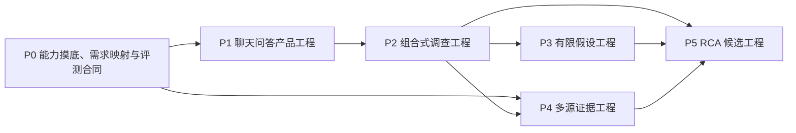

# 国家中断 Agent 建设总纲

版本：1.3
状态：计划级边界候选
适用范围：Domeye `country_outage` 能力从用户需求研究演进到 RCA 候选

## 一、总纲定位

国家中断 Agent 不是一个以 P0 至 P5 表示的单体功能。P1 至 P5 是五个逐步扩展能力的
建设工程；P0 是在这些工程前面启动、并贯穿后续建设的系统能力摸底、需求映射与评测
工程。P0 先实测当前页面、正式 API、publication/read model、相关后端服务和可追溯
中间数据，再形成足以启动 P1 的能力账本与小规模评测合同；后续随能力变化持续更新。

本总纲只规定：

- 一条评测工作流和五个能力工程为什么存在、彼此如何依赖；
- P0 与 P1 至 P5 分别交付什么、不能宣称什么；
- 工程之间以什么制品和证据完成交接；
- 哪些事实、因果、数据源、模型和发布边界不能被后续工程静默改写；
- 每个工程内部为什么必须先冻结能力与工具合同，再冻结可执行语义映射；
- 两级 Hook 和验收状态如何防止越级宣告。

本总纲不代替任何单项工程的最终验收，不规定具体语言、框架、模型供应商、进程形态、
人员排期或实现步骤。

## 二、为什么要区分一条评测工作流和五个能力工程

P0 至 P5 分别解决需求评测、交互、调查、假设、多源证据和因果验证问题。它们的输入、
失败方式和完成证据不同：

- P0 的核心对象是当前系统能力、分层证据、小规模验收问题、开放用户目标和评测真值；
- P1 的核心对象是事件绑定、P1 能力与工具合同、多轮问答和可信边界；
- P2 的核心对象是调查计划、确定性分析算子和 Evidence Graph；
- P3 的核心对象是假设状态、双向证据和人工确认；
- P4 的核心对象是不同测量方法、来源身份、时间对齐和冲突；
- P5 的核心对象是因果模型、反事实、真值评测、校准和正确弃答。

若把全部工作写成一个分阶段计划，会让 P4/P5 的未来数据条件反向阻塞 P1/P2，也会让
P1/P2 的局部成功被误写为“RCA Agent 已完成”。因此 P0 只提供最小入口和持续回归，
P1 至 P5 分别建立工程级验收。

## 三、计划结构与依赖



### 3.1 工程内共同依赖规则

P0 至 P5 不新增一个名为“工具建设”的独立大工程，但每个能力工程内部都必须遵守：

```text
系统与证据边界
  → 现状能力/数据可得性勘探与 feasibility 证据
  → Candidate Capability Ledger
  → Capability Catalog
  → Typed Tool / Operator Contract 与算子 Oracle
  → Semantic Plan Schema、Policy Validator 和状态转换合同
  → 自然语言 Planner Shadow
  → 受控执行、事实/证据后校验和原子状态提交
```

P0 负责第一次现状能力勘探；P1 至 P5 引入新能力或新来源时，也必须引用 P0 的能力账本
或产生等价的增量发现证据。这里的前置项是能力发现证据和工具的**业务合同**，不是要求
先完成该工程的全部工具实现：

- 真实问题收集和开放的用户目标语义可以先行或并行，且必须完整保留当前不支持的目标；
- 页面可见、API 已发布、后端已有未发布、确定性可推导、语义未冻结、不可用和越界必须
  分层记录；源码、测试、数据或理论可计算性不能单独证明产品能力；
- 一旦要给子目标标注具体 `capability`、`operator`、参数或 `answerability`，对应 Catalog、
  Typed Contract、缺失/错误语义和算子 Oracle 必须已经冻结；
- 用户目标语义不得被当前工具名裁剪；原因、责任、用户影响或其他未支持请求仍须被正确
  理解，但只能映射为 `partial`、`clarify`、`unsupported` 或失败关闭；
- 执行层只接受冻结白名单内的 grounding。模型、Prompt 或聊天上下文不得创造工具、扩张
  权限或把未支持目标改标为可执行；
- 每个工程可以先完成最小可验收工具纵向切片，再开展 Planner Shadow；不得把 P2 至 P5
  的全部工具、外部来源或 RCA 算子作为 P1 语言理解的前置条件。

因此，“先定义工具”在本计划中始终指先冻结当前工程的 Capability Catalog、Typed Tool /
Operator Contract 和 Oracle，不指先穷举用户表达，也不指先实现全部未来工具。

这不是简单串行关系：

- P0 的最小能力纵向切片、能力账本、P1 候选范围和首版 35 个验收案例稳定后开放 P1；
  公开问题和回归集不要求一次收齐，后续随能力变化按新 revision 扩充；
- P4 的来源研究可以在 P1/P2 期间独立进行，但产品集成必须使用 P2 已冻结的证据和
  调查语义；
- P5 必须同时取得 P2 的确定性调查制品、P3 的假设边界和 P4 的多源证据；
- 任一依赖没有正式交接回执，P5 只能做研究，不得进入产品 RCA 候选验收。

## 四、一条评测工作流和五个能力工程

### P0：系统能力摸底、需求映射与评测合同

目标是先摸清 `country_outage` 当前页面、正式 API、publication/read model、相关后端
服务和可追溯中间数据实际能够支持什么，再把用户需求、能力候选、缺口和关键失败场景
转化为一套小而可执行的评测合同，并在 P1 至 P5 建设期间持续维护。

最终交付至少包括：

- 系统表面清单和版本化 Capability Discovery Ledger；
- 页面可见、API 已发布、后端已有未发布、确定性可推导、语义未冻结、不可用、越界和
  未知的分层状态及证据；
- 只读 feasibility spike、冻结输入输出和可供 P1 扩展的 Oracle seed；
- 第一版固定 35 个验收案例：20 个系统能力直接问题、5 个多轮旅程、5 个越界
  问题、5 个数据缺失、冲突或异常问题；
- 每个案例的请求类型、实体、分析算子、可回答性和证据需求；
- 用户实际请求的目标语义，与当前能力映射、业务算子和回答等级分层记录；
- 预期事实、证据引用、禁止断言、正确弃答和异常结果；
- 案例集 revision、被测版本和执行结果身份；
- P1 `adopt`、`defer`、`reject` 候选处置，以及必须支持、允许降级和明确不支持的入口清单；
- 后续每增加一种分析能力时同步增加的评测增量。

公开网络问题用于补充真实表达、发现遗漏和调整优先级，不要求第一版每个案例都来自
一个外部帖子，也不设置平台、角色或来源数量配额。

P0 通过不表示 feasibility 候选已经成为正式 API、生产工具、聊天页面、意图模型或 Agent。

### P1：聊天问答产品工程

目标是在一个合法 `country_outage` 事件和冻结 RRC25 publication 上，形成可连续追问的
聊天式问答产品。

最终交付至少包括：

- 基于 P0 Capability Discovery Ledger、候选处置和当前 RRC25 证据冻结的 P1 Capability
  Catalog；P1 不重新把系统能力发现作为隐含任务，但必须复核采用项仍绑定同一运行与数据
  身份；
- Typed Read Tool / Operator Contract、参数与身份约束、缺失/错误语义及算子 Oracle；
- 开放用户目标到封闭 capability/operator grounding 的映射合同和独立 Policy Validator；
- 事件绑定、上下文可见和必要澄清；
- 事实、指标语义、证据边界和证据不足四类回答；
- 短期多轮状态、取消、重连、会话到期和 revision 切换；
- 关键数字与同快照证据下钻；
- P0 黄金问题集中 P1 范围问题的同候选验收；
- P2 的正式入口回执。

P1 通过只能称为 RRC25 事件绑定聊天问答，不表示具备组合调查或原因分析。

### P2：组合式调查工程

目标是先扩展并冻结 P2 Capability Catalog、只读 Typed Tool / Operator Contract 与算子
Oracle，再把复杂问题拆为可校验调查计划，并使用确定性分析算子和 Evidence Graph 组合回答。

最终交付至少包括：

- 多目标调查请求和白名单调查路径；
- P2 新增能力、工具、参数、权限、证据身份和失败语义的版本化合同；
- 时间线、范围、ASN、地址族、Update 活动、资源和路径分析算子；
- Fact、DerivedFact、Claim、Limitation 和 Unknown 的可审计图；
- 多任务局部成功、局部失败和证据不足语义；
- 页面、趋势、报告和调查回答的同事实一致性；
- P3 和 P4 的正式入口回执。

P2 通过只能称为 RRC25 组合式调查助手。Evidence Graph 本身不构成 Agent，也不构成
因果图或 RCA。

### P3：有限假设工程

目标是在 RRC25 事实合同内提出可检验的观察命题，并通过人工确认、支持证据、反对
证据和缺失证据管理假设状态。

最终交付至少包括：

- 允许和禁止的假设类型；
- 建议、确认、检验、撤销和状态变化；
- 支持、反证、替代观察和缺失证据；
- 模型不能改变的假设状态和正确弃答门；
- P5 的假设语义交接回执。

P3 不确认政府行为、攻击、配置错误、设施故障、全国断网、用户影响、责任主体或真实
根因，不得称为 RCA Agent。

### P4：多源证据工程

目标是在不改写 RRC25 核心事实的前提下，引入数据面、DNS、HTTP、IODA、OONI、
运营状态或其他经过认证的独立证据源，并建立可比较和不可比较的确定语义。

最终交付至少包括：

- 每个来源的证据包络、方法、时间、覆盖、质量、许可和不可变身份；
- 安全、授权、限额、失败关闭和独立来源认证；
- 国家、网络对象、地址族、时间网格和窗口对齐；
- 相互支持、相互冲突、时差、覆盖不重叠、来源不可用和证据不足；
- 多源结果不污染 RRC25 Fact 和核心 Claim 的隔离证明；
- P5 的多源证据交接回执。

P4 通过表示能够评估控制面与其他测量信号的一致性，不表示能够确定真实原因。

### P5：RCA 候选工程

目标是在冻结原因类型、已认证来源组合和独立真值评测范围内，评估因果候选、替代解释
和反事实，并决定何时可以发布 RCA 候选、何时必须弃答。

最终交付至少包括：

- 原因类型和适用事件范围；
- 因果方向、必要条件、支持、反证、替代解释和缺失证据；
- 可计算反事实及失败语义；
- 与开发示例隔离的真值集；
- 候选排序、置信校准、错误归因和正确弃答门槛；
- 模型、规则、来源、原因类型或评测集变化后的重新认证规则。

P5 通过只能称为“RCA 候选能力在已验收场景内成立”，不能无条件称为 Network RCA
Agent，也不构成对政府、运营商或其他主体的责任认定。

## 五、全计划不可改变的边界

### 5.1 RRC25 核心事实身份

- P0 至 P3 从始至终只使用 RRC25 这一 collector 的已发布 BGP 控制面观测；
- 事件事实必须绑定 incident、publication、revision、cohort、窗口、`data_through`、
  finality、算法和 mapping 身份；
- P4/P5 的其他来源保持独立 Evidence 身份，不进入或改写 RRC25 Fact；
- 旧 publication 和旧回答保持原身份，新 revision 不静默覆盖历史结论。

### 5.2 事实、假设和因果分级

```text
RRC25 Fact / DerivedFact
        ↓
受证据约束的 Claim
        ↓
P3 有限观察 Hypothesis
        ↓
P4 多源支持、冲突与缺失
        ↓
P5 因果候选、反事实与真值评测
```

任何后续层都不能反向改写前序事实。相关性、时间先后、共同变化、多源一致和模型置信度
都不能单独证明因果。

### 5.3 状态和发布语义

`designed`、`implemented`、`tested`、`accepted`、`merged`、`built`、`certified`、
`deployed` 和 `production_verified` 是不同状态。工程 Hook、阶段验收或交接回执不能
越级证明合并、发布或生产完成。

## 六、工程交接门

P1 至 P5 每个工程出口必须形成同一身份的交接包；P0 以持续更新的能力与评测 revision
作为各工程共同输入：

1. 最终验收文档和分阶段计划版本；
2. 各阶段验收记录和未关闭偏离；
3. 上游 Capability Discovery Ledger、能力缺口和候选处置，以及本工程的 Capability
   Catalog、Typed Tool / Operator Contract、算子 Oracle、机器 Schema、Policy、
   配置和评测规则；
4. 实际输入、输出、测试、浏览器或模型证据摘要；
5. 交付物清单及 SHA-256；
6. 当前实现、候选、模型、数据和环境身份；
7. 下一工程能够读取的接口或制品；
8. 明确不随交接转移的权限、未知和风险。

下一工程只能读取正式交接包，不得把上一工程的聊天记录、开发样例、临时文件或模型
记忆当作权威输入。

## 七、文档与 Hook 治理

### 7.1 两级文档

- 本总纲是计划级边界，不给出某个工程的最终通过结论；
- P0 维护能力摸底与评测文档、阶段计划和持续增量规则；P1 至 P5 分别维护最终验收文档
  和分阶段计划；
- 最终验收文档只设计该工程最终效果；
- 分阶段计划只写阶段入口、前端或使用效果、后端或评测效果、出口和边界；
- 后续工程不得通过修改总纲或前序最终验收文档消除已经确认的偏离。

### 7.2 两级回检

- **阶段回检**：检查当前 P 工程内部的阶段出口是否偏离本工程最终验收；
- **工程交接回检**：检查全部阶段、交接包和下一工程入口是否闭合。

统一调用形式：

```bash
python3 .codex/hooks/country_outage_agent_program_review.py \
  --project P0 \
  --stage S0
```

Hook 可以检查文档结构、编号、阶段映射、任务路径、冻结核心信号和证据清单，但不能仅凭
退出码判断数据、页面、模型、浏览器、用户价值、部署或生产效果已经通过。

## 八、当前执行顺序

当前只展开 P0 系统能力摸底、需求映射与评测合同：

- 冻结 P0 最终验收文档；
- 冻结 P0 分阶段计划；
- 建立通用项目阶段 Hook 和 P0 配置；
- 先形成系统表面清单、Capability Discovery Ledger、unknown ledger、最小 feasibility
  证据和 P1 候选范围，不把现有页面/API 或源码清单当成已知能力边界；
- P0 先保留开放用户目标和业务算子真值，不以未实现的具体工具名裁剪真实需求；
- P0 第一版能力账本、35 个案例和正式 P1 入口回执形成后，即可展开 P1 的详细最终验收
  和分阶段计划；P1 从 P0 经验证候选中选择能力，冻结自身 Capability Catalog、Typed
  Tool / Operator Contract 和完整算子 Oracle，随后才能冻结可执行语义计划真值并接入
  Planner；P0 的后续扩充与 P1 建设并行。

P1 至 P5 在本总纲中只表示计划级目标和依赖，不表示已经设计完成、已经实施或具备正式
验收入口。
