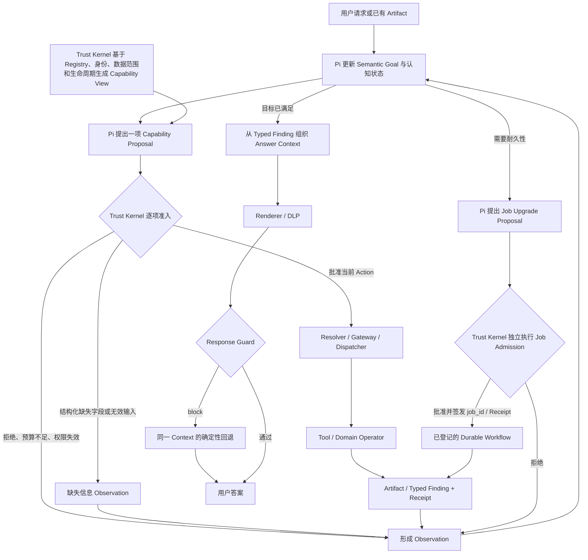

# Domeye Agent 目标架构 v1.1

> 本次重构的第一基石：先明确系统最终要变成什么，再决定保留、迁移或删除哪些代码。

| 项目 | 内容 |
|---|---|
| 文档版本 | v1.1 |
| 决策状态 | 已确认，作为本次重构的首要架构依据 |
| 仓库状态 | 已纳入七份核心交接包的仓库候选；当前仍只证明 `Designed` |
| 日期 | 2026-08-16 |
| 适用范围 | Domeye Agent 的认知、准入、执行、证据、回答和横切治理 |
| 不代表 | 这些能力已经实现、已经测试、已经上线 |
| 产品边界 | [Domeye 产品、数据与 Claim 边界 v1.1](Domeye_Product_Data_Claim_Boundary_v1.1.md) |
| 当前首片 | [Domeye 首个纵向切片锚点合同 v1.0](Domeye_First_Vertical_Slice_Anchor_v1.0.md) |

---

## 1. 为什么它是第一基石

这份文档回答的是一个很具体的问题：

> Domeye 重构完成后，一条用户请求应该怎样被理解、批准、执行、形成证据并发布回答？

它排在代码计划、Issue、Milestone 和 Project 前面。原因不是“文档比代码重要”，而是后面所有工作都必须知道自己在向哪里迁移。

以后的判断顺序如下：

1. **目标架构**说明最终责任边界和禁止路径。
2. **当前代码基线**说明某个提交上真实存在什么。
3. **22 项整改跟踪**说明已知风险怎样被关闭。
4. **ADR**记录重要选择及其理由；已批准的新 ADR 可以修订本架构。
5. **GitHub Milestone / Project / Issue**负责安排交付，但不能擅自改写架构。
6. **测试、评测、构建和发布证据**证明某个候选是否真的达到要求。

因此：

- Issue 写了不等于架构实现了；
- 代码合并了不等于通过验证；
- 某层有代码不等于端到端 Agent 已经可用；
- 本文写明目标也不等于当前代码已经符合目标。

发生冲突时，先停止实现并显式处理冲突，不允许开发者在代码里暗自选择一种解释。

---

## 2. 这次重构要纠正什么

当前代码已用首个纵向切片 Candidate 固定一个只读 Tool、一个确定性 Operator、Typed Finding、最小 Answer Context、Renderer、Response Guard、Artifact / Receipt 和 Trust Kernel 边界，也保留 BGP 领域与审计资产。旧 P1 / P2 的通用 Plan、ResultSet、Investigation 和 CAS 原型已经退役；当前缺口是把已经验证的窄闭环扩展到目标架构，而不是恢复旧主路径。

旧主路径容易变成：

```text
用户问题
  → 一次性识别问题类型
  → 生成或编译完整 Plan / DAG
  → Host 按整张图执行
  → 拼接答案
```

这会带来三个问题：

1. 模型在看到真实执行结果以前，未来步骤已经被提前决定；
2. Question Template、问题分类和固定 DAG 容易变成生产路由表；
3. Host 同时承担规划、授权、实现选择、执行和回答，逐渐变成难以审计的 “God Host”。

新的主路径改为滚动闭环：

```text
理解当前目标
  → 只提出下一项能力请求
  → 可信 Host 独立批准或拒绝
  → 执行并产生 Artifact / Receipt
  → 模型观察真实结果
  → 再决定下一步、澄清、停止或组织回答
```

关键变化不是把旧 Plan 换一个名字，而是**取消“入口生成完整执行图”作为开放任务的生产主路径**。

---

## 3. 六条基本决定

### 3.1 开放任务由 Agent 滚动规划

步骤无法在入口可靠枚举、需要根据结果继续判断的任务，由 Pi Agent 循环处理。每轮只提出一个下一步，执行结果回来以后再决定后续动作。

### 3.2 需要耐久性的确定性执行使用 Workflow

普通确定性 Tool / Operator 可以由 Interactive Action 直接执行。只有路径稳定、规则明确，并且确实需要重试、恢复、取消、异步等待或受控并发的工作，才进入 Job 内的确定性 Workflow。Workflow 只能执行已经准入的工作，不能替 Agent 理解用户意图。

是否需要 Workflow，依据当前 Proposal / Job 的耐久性要求决定；不能先按用户问题、Question Template 或 Capability Family 做一次分类，再把请求分流到 Agent 或 Workflow。

### 3.3 Pi 的调用只是提议

Pi 可以提出 Capability Proposal，但不能给自己授权，也不能选择凭据、处理器或任意实现版本。

### 3.4 Trust Kernel 拥有正式提交权

身份、权限、预算、Registry 绑定、执行准入和正式状态由可信 Host 中的 Trust Kernel 决定。它依据确定性合同工作，不替 Pi 规划问题，也不需要为普通聊天回答逐句签发事实。

### 3.5 对外事实必须来自 Typed Finding

Tool 可以直接产生 Observed Finding / Artifact；Operator 基于合格输入产生版本化、可重放的 Derived Finding / Artifact。回答只能从这些 Finding 及其范围、人口、时间和限制组织。模型负责表达，不得新增 Finding 中不存在的业务事实。Renderer 之后只做轻量、确定、可测试的 Response Guard，不建设通用 Claim 词表、Claim 状态机或独立 Claim Publisher。

### 3.6 Capability Family 不负责问题路由

Capability Family 用于整理合同、文档、版本、适用边界和评测覆盖。它不是 Intent 标签、Question Template 索引，也不能映射到固定 DAG。

---

## 4. 运行时主循环

### 4.1 动态运行图



这张图表达的是一个循环，不是 L1 到 L7 只走一次的流水线。

### 4.2 每一轮允许发生什么

Pi 在观察结果后只能选择：

- 再提出一个 Capability Proposal；
- 请求用户澄清；
- 停止并说明为什么不能继续；
- 建议把工作升级为 Durable Investigation Job；
- 在已有 Typed Finding 足以满足目标时进入回答组织。

以下做法不是目标路径：

- 在入口一次性签发所有未来 Action；
- 第一个结果尚未返回就预先批准第二个动作；
- 准入只在会话或 Plan 开头检查一次；
- 失败、拒绝或部分结果被吞掉，不返回给 Pi；
- 让 Pi 直接调用具体 handler 或携带凭据执行。

### 4.3 一个直观例子

用户问：“这次事件里哪个 ASN 的控制面变化最大？”

目标路径可能是：

1. Pi 理解比较目标，但此时没有事实；
2. Pi 提议读取获准事件中的 ASN 人口；
3. Trust Kernel 检查用户身份、事件范围、预算和 Registry 版本；
4. Tool 返回冻结人口和 Receipt；
5. Pi 观察人口，再提议调用“按已登记变化指标排序”的 Capability；
6. Operator 产生排序 Typed Finding，并明确指标、分母、IPv4/IPv6、观察范围和局限；
7. Answer Context 选择该 Finding 和必须随附的限制；
8. Renderer 将它表达为“在该指标和 RRC25 观察范围内，ASN X 排名第一”；
9. Response Guard 检查数字、对象、范围词和禁用语义；若出现“全国影响最大”等放大表述，
   则返回 `block`，丢弃原草稿并从同一 Answer Context 生成确定性安全答案，不再次调用模型。

这里没有“识别到排名题，因此命中排名模板和固定 DAG”。同一个能力也可以服务于未见过的说法。

---

## 5. 最小合同，而不是一个超级 Plan

系统统一的是一组小而明确的合同，不是一个包揽对话、执行、证据和回答的 Common Plan IR。

| 合同 | 用人话解释 | 不允许包含什么 |
|---|---|---|
| Semantic Goal | 当前到底想解决什么、已知什么、缺什么 | handler、凭据、已批准的未来步骤 |
| Goal State | Pi 当前依据的 Artifact、未解决问题和停止原因 | 已批准未来动作或任意事实创造权 |
| Capability View | 当前身份和上下文真正可见的能力清单 | 未获准能力、底层秘密、任意实现细节 |
| Capability Proposal | Pi 请求尝试的下一项能力及参数 | “已经获准”的自我声明、具体 handler 选择 |
| Admission Decision | Trust Kernel 对这一项提议的批准、拒绝，或结构化缺失 / 无效输入 | 自然语言规划、面向用户的澄清措辞和领域推理 |
| Interactive Action | 一次获准能力执行的生命周期 | 未来完整 DAG |
| Investigation Job Spec | 耐久任务的目标、约束、证据要求、预算和人口引用 | 从用户问题直接编译的完整 handler 图 |
| Artifact Envelope | 冻结的结果、Schema、人口、版本和内容身份 | 未标识来源的自由文本事实 |
| Receipt | 谁、在什么版本和政策下做了什么 | “有 digest 所以已授权”的推断 |
| Typed Finding | Tool 观察或 Operator 派生的类型化结果；公共身份由 Artifact Envelope 继承 | 自由文本叙事、未登记业务推断、已获准执行的自我声明 |
| Answer Context | 为当前回答选择的 Finding、限制和允许表达范围 | 新计算、隐含因果、独立事实状态机 |
| Response Guard Result | 一次回答内对数字、单位、时间、范围、限制、DLP 和禁用语义的轻量检查结果 | 新的持久状态机；对世界真相或任意自然语言蕴含关系的通用证明 |

合同应版本化，并且能被机器验证。增加字段要说明兼容性；改变语义必须换版本，不能只改文字说明。

---

## 6. 七个架构层

分层图用于说明责任归属，不代表请求永远只从上往下走。L6 的结果会回到 L1；L7 继承 L2 已确定的身份、数据权限和输出策略，但普通回答不需要再建立一套逐句授权流程。

### L1 — Agent Cognitive（认知层）

**负责：**

- 理解用户目标和多轮指代；
- 维护认知状态；
- 从受限 Capability View 中提出一个下一步；
- 观察成功、失败、拒绝、部分结果和预算状态；
- 重新规划、澄清、停止或在目标满足后进入回答组织。

**不能做：**

- 直接执行 Tool；
- 选择具体 handler、凭据或实现版本；
- 批准自己的请求；
- 提交正式状态或把猜测写成事实；
- 生成一张必须照办的完整 DAG。

### L2 — Domeye Trust Kernel（可信控制内核，简称 Trust Kernel）

**负责：**

- 绑定 principal、tenant、事件和 publication；
- 执行 Policy、Permission IR、预算和撤销检查；
- 管理 Registry 生命周期与快照身份；
- 对每个 Action 或 Job 操作独立准入；
- 生成不可抵赖的 Receipt；
- 控制正式状态，并为有敏感数据、外部导出或自动行动的渠道执行额外发布策略。

**不能做：**

- 替 Pi 理解用户问题；
- 把领域计算藏进权限判断；
- 因为代码运行在 Host 内就自动信任；
- 把 Gate 当成可被 Plan 跳过的普通节点。

### L3 — Action、Job 与 Workflow 合同

**负责：**

- Interactive Action 的状态和边界；
- Durable Investigation Job 的目标、约束和生命周期；
- 结束超出边界的 Action，并以事务化交接创建、独立准入 Job；
- 在 Job 内接入成熟的重试、恢复、取消、等待和受控 fan-out；
- 保存 Workflow 状态，但不复制 Agent 的认知循环。

**不能做：**

- 建立 Common Plan 超级 IR；
- 按 Question Template 选择执行图；
- 建第二套 Agent Loop；
- 在 Job 创建时提前保存所有未来领域动作；
- 让 Workflow 绕过 Gateway 直接选择实现。

### L4 — Capability Execution（能力执行层）

**负责：**

- 将已准入的 Capability 解析到已登记执行单元；
- 提供 Gateway、Resolver、Dispatcher 和 Typed Adapter；
- 校验输入、输出和实现版本；
- 把执行结果以统一 Envelope 返回。

**不能做：**

- 让模型选择具体实现；
- 让 Adapter 偷做业务判断；
- 绕过 Trust Kernel；
- 再建立一套 Registry 或 Dispatcher。

Adapter 只做 projection、canonicalization、coercion 或明确声明的结构转换。只要语义发生变化，就应升级为有版本的 Domain Operator。

### L5 — Deterministic Compute（确定性计算层）

**负责：**

- Tool 读取受限事实人口；
- Domain Operator 做版本化、可重放的领域计算；
- 明确 Schema、空值、单位、顺序、基数、完整性和错误语义；
- 在确有必要时执行已登记的受限 Compute Contract。

**不能做：**

- 接受模型提交的任意 SQL 或代码；
- 调用 LLM；
- 取得授权或直接生成最终自然语言答案；
- 把未登记的业务判断藏在 Tool 查询中。

受限 Compute Engine 不是默认建设项。只有评测证明现有 Operator 组合不能经济地完成通用集合、连接或聚合时，才通过 `DG-COMP` 独立决策门判断是否引入。

### L6 — Artifact / Evidence（制品与证据层）

**负责：**

- 保存不可变或有明确 revision 的 ResultSet、Artifact 和 Receipt；
- 表达声明人口、分区、分页和完整性；
- 分开维护 Execution Provenance、Data Lineage 和 Domain Evidence；
- 让后续计算、回答和审计能重放、追溯到具体 Finding；Answer Context 对 Finding 的选择只进入回答 Trace，不建设独立 Finding Support Graph。

**不能做：**

- 把 Trace 或模型摘要当作事实；
- 静默修改已发布 Artifact；
- 用一个含义模糊的 EvidenceGraph 混合所有关系；
- 把 query complete 写成 world complete。

三类核心语义可以共用物理存储，但 Schema 和关系含义必须分开。R06 要求语义分离，不要求每一类都建设独立平台。

### L7 — Answer Composition & Guard（回答组织与边界检查层）

**负责：**

```text
Typed Finding / Artifact
  → Answer Context
  → Renderer / DLP
  → Response Guard
  → 用户答案；`block` 时丢弃草稿并使用同一 Context 的确定性回退
```

Finding 本身保存业务结果和必要支持；publication、collector、window、population、completeness、lineage 等公共信息优先由 Artifact Envelope 继承，不在每一句话上重复建立对象。比例 Finding 必须显式携带 denominator，时间 Finding 必须表达证据支持的精度和删失状态。

**不能做：**

- 让模型根据原始 Tool 文本自由创造业务事实，再事后补引用；
- 只因为“有引用”就认定自然语言一定受支持；
- 让 LLM Reviewer 成为唯一边界检查；
- 把“首次观测到”渲染成“实际发生于”，或把 RRC25 观察扩大成全国事实。

Response Guard 只承担可以明确测试的表达对齐：核对数字、单位、时间、对象、范围词、
必要 limitation、DLP 和领域禁用语义，只返回 `pass/block`。它不改写草稿，也不宣称证明
任意自然语言蕴含关系。NLI、反向事实抽取或第二模型只能作为决定前的附加告警，不能在
`block` 后触发再次生成。

---

## 7. 四个横切面

横切面不是最后上线前再补的四个模块。它们必须在每个候选、每个里程碑中有明确要求。

### X1 — Eval / Release

- Deterministic Contract Conformance：合同和确定性函数是否正确；
- Agent Task Certification：真实模型、真实 Tool 和真实状态下，任务是否完成；
- Production Promotion：同一候选是否满足窄范围发布要求。

评测记录 Goal、Proposal、Admission、Action / Job、Observation、Artifact / Finding、Answer Context、Guard Result 和 Outcome。Pass@1 用于单次成功；连续稳定性应单独报告，例如 3/3 或 Pass³，不能用“多试几次至少成功一次”掩盖不稳定。

### X2 — Security / Supply Chain

- 版本化 Permission IR；
- principal / tenant 隔离；
- prompt injection、参数走私、历史状态污染测试；
- 输入、Tool 输出、Artifact 组合和 Renderer / Sink 的 DLP；
- builder、source、image、dependency、model、prompt、Tool Schema 的身份链；
- digest、签名、授权和适用性的含义分开。

Pi 侧 guardrail 只是预检。最终权限决定和执行证据必须来自 Trust Kernel。

### X3 — Observability / SLO

- Action 顺序、耗时、错误和停止原因；
- calls、rows、bytes、tokens、费用、重试、排队和 fan-out；
- turn、job、tenant 各级预算；
- P50 / P95 / P99、backpressure、degraded mode、保留和清理策略。

Trace 说明系统做过什么；Evidence 说明某个事实为什么成立。两者不能互换。

### X4 — Product / Data Boundary

- 明确产品究竟回答什么，不回答什么；
- 区分 query completeness、source completeness、observer completeness 和 world completeness；
- Finding 与最终措辞的范围不得超过数据和观察者范围；
- BGP 控制面观测不得自动上升为全国影响、用户影响、原因、责任、商业关系、物理直连、流量路径或恢复结论。

产品边界必须从 Capability View、计算语义、Artifact / Finding 一直传到 Answer Context 和 Response Guard，不能只写在页面免责声明里。

---

## 8. Interactive Action 与 Durable Investigation Job

二者不是“短问题”和“长问题”的区别，也不是两套 Agent。

| 判断项 | Interactive Action | Durable Investigation Job |
|---|---|---|
| 基本单位 | 一次已准入的 Capability 执行 | 一个需要耐久管理的调查目标 |
| 未来动作 | 不预存；结果回来后由 Pi 再决定 | Workflow 可保存确定性内部状态，但领域下一步仍受准入 |
| 恢复 | 当前交互内完成，不承诺跨进程恢复 | 进程重启或跨请求后可恢复 |
| 重试 / 取消 | 有界、即时 | 有正式重试、取消、幂等和恢复语义 |
| fan-out | 仅在交互预算内的有界操作 | 冻结人口后的受控 Bounded Map |
| 跨会话 | 不依赖 | 可以 |
| 选择依据 | 当前动作不需要耐久能力 | 确实需要恢复、重试、取消、异步等待、fan-out、跨会话或多次正式提交 |

Action 运行中发现人口、预算或可靠性要求超出边界时，不能在原 Action 内直接扩大权限。正确做法是：当前 Action 以 `upgrade_required` 结束，再事务化创建一个新的 Job Proposal，并由 Trust Kernel 独立准入。交接必须继承：

- goal_id；
- principal / tenant；
- publication；
- 已有 Artifact 引用；
- 已生成 Receipt；
- 剩余预算和限制。

交接时不能重新解释原始聊天文本，也不能借机扩大权限。只有 Job Admission 通过后才签发新的 `job_id` 和 Receipt，并进入已登记的 Durable Workflow；拒绝结果也要返回 Pi 成为 Observation。

---

## 9. Capability Family 的正确位置

Capability Family 位于设计、Registry 治理和评测覆盖面，不位于自然语言生产路由主路径。

它可以用于：

- 把相近 Capability 合同放在一起维护；
- 说明版本、依赖、适用范围和禁止结论；
- 安排评测数据和 held-out 表达；
- 观察某类能力的建设覆盖。

它不能用于：

```text
用户问题 → question_id → capability_family → template_id → 固定 DAG
```

生产运行时只向 Pi 暴露当前上下文中经过 Trust Kernel 过滤的 Capability View。同一问题可以组合多个能力，同一能力应支持未见表达，同一目标可以存在多条有效轨迹。

固定 Workflow 只能作为高风险、稳定 Job 的内部已登记实现。Job 准入后，由 Registry Resolver 按 Trust Kernel 的决定绑定具体 Workflow；Workflow 不解析自然语言、不选择其他模板、不决定新的领域动作，也不能扩大范围。自然语言问题不能直接命中模板。

---

## 10. Registry、身份与 Gate

Registry 不是简单的 ID 字典。它必须回答：

- 这个 Capability、Tool、Operator、Adapter 和 Policy 是哪个版本；
- 当前是否 active、deprecated、revoked 或 deferred；
- 由哪个实现、Schema、依赖和构建身份提供；
- 对哪个 principal、tenant、publication、数据标签和预算适用；
- 一次执行到底绑定了哪个快照。

Receipt 至少绑定主体、候选、Registry snapshot、Policy 版本、实现摘要、输入摘要、结果摘要、时间和处置。

Renderer、Prompt、Guard 规则及其构建身份进入回答 Trace 和评测候选，不扩大 Capability Registry 的职责。

Gate ID 不能只写 `GATE-01` 然后反复改变含义。每个 Gate 应有不可复用的语义 URI 和版本。Gate 是控制面不变量，任何 Action、Job 或 Workflow 路径都不能选择、重命名或跳过它。

---

## 11. 状态语言

本次重构严格区分以下状态：

| 状态 | 含义 |
|---|---|
| Designed | 目标、合同或边界已经写清楚 |
| Tracked | 有 Issue 或 Project item；这是客观跟踪事实，不是完成度 |
| Planned | 已进入 Milestone 或路线安排 |
| Implemented | 同一候选的代码、配置或制品已经存在 |
| Verified | 同一候选的验收证据已被接受 |
| Released | 目标用户或生产环境可用，并有发布身份和回滚证据 |

这些状态不能互相冒充。尤其：

- 文档只能直接支持 Designed；
- 合并代码最多说明 merged，不能自动说明 Verified；
- fixture 通过不等于真实 Agent 通过；
- 旧路径上存在实现，不等于目标架构层已经完成；
- Project Dashboard 建好不等于产品能力建好。

### 11.1 仓库主干的新规则

从 2026-08-16 起，Domeye 使用 `main` 作为：

- 永久主干；
- Pull Request 的默认合并目标；
- 合并后代码的权威位置；
- 构建、测试、候选身份和当前代码基线的默认取证起点。

仓库现有 `AGENTS.md` 或旧发布资料中仍把 `codex/prod` 写成永久生产主干的内容，属于待迁移的旧规则。它不能继续覆盖本节，也不能用来否定已经进入 `main` 的合并代码。后续应单独修订分支保护、CI、发布脚本和文档，使它们统一指向 `main`。

`main` 是权威主干，不等于其中每个提交都已发布。某个提交仍要分别经过构建、验证、候选冻结、部署和上线证据，才能使用相应状态。

---

## 12. 决策门

里程碑描述“系统下一阶段要能做什么”，决策门回答“同一个候选是否真的可以进入下一阶段”。

| Gate | 要回答的问题 | 最低结果 |
|---|---|---|
| DG0 — 架构与首个切片准备 | 目标边界、当前基线、首个真实场景、候选身份和验收阈值是否清楚 | GO / REPAIR / STOP |
| DG1 — Interactive Agent Loop | 成功、拒绝、失败后重选是否在同一候选上形成真实滚动闭环 | GO / REPAIR / STOP |
| DG2 — Finding-to-Answer | 所有对外事实是否来自 Typed Finding；范围和限制是否进入 Answer Context；Renderer 漂移能否被 Guard 阻断或安全回退 | GO / REPAIR / STOP |
| DG-DUR — Durable Job 建设决策 | 是否已经出现恢复、取消、重试、异步等待、受控 fan-out、跨会话或多次正式提交的真实需求，值得开始建设 Job | GO / REPAIR / STOP |
| DG3 — Durable Job 实现验收 | 同一候选能否恢复、取消、重试、撤权并正确处理部分失败 | GO / REPAIR / STOP |
| DG-COMP — 受限计算引擎决策 | 现有 Tool / Operator 是否确实无法经济地完成受控集合、连接或聚合；是否有必要引入模型不可见的受限 Compute Engine | GO / REPAIR / STOP |
| DG4 — 动态能力组合认证 | 未见表达和多能力组合是否不依赖问题模板或固定 DAG | GO / REPAIR / STOP |
| DG5 — 窄范围发布 | canary、SLO、安全、停用、回滚和产品边界是否在同一候选上通过 | GO / REPAIR / STOP |

本版把 `DG-COMP` 专门保留给受限 Compute Engine 决策；旧资料若曾用它表示“能力组合”，应迁移为 `DG4`，不能让同一个 Gate ID 承担两种语义。

Gate 不能靠 Issue 数量、代码合并或“每层都有一个模块”自动关闭。每个里程碑还要列出 L1–L7、X1–X4 的主建设、集成回归或明确不适用，不能留空。

---

## 13. 对现有代码的迁移原则

### 13.1 优先保留

- 当前 Candidate 已固定的只读 Tool 和确定性 Domain Operator；
- Registry snapshot、版本绑定和 fail-closed 校验；
- 经当前 Candidate 证明仍存续的内容寻址 Artifact、Receipt 和可重放计算；
- BGP 领域边界、时间语义、人口和证据合同；
- `backend/core/` 冻结核心及其摘要校验。

保留不等于直接宣称符合新架构。资产要通过新的 Action、Artifact、Typed Finding 和回答边界接入后，才算目标路径实现。

### 13.2 退出生产主路径

- Question Template 生产路由；
- `normalized_kind → 固定 Tool / Operator → 完整 DAG` 主路径；
- Common Plan IR；
- P1 / P2 作为永久运行 Profile；
- Teacher → Student 作为默认回答链；
- 先生成自然语言答案、再补事实验证；
- 让 Host 同时承担规划、授权、业务计算和事实发布。

旧 `SemanticPlan`、`GroundingPlan`、`InvestigationPlan` 名称只保留在历史证据和 Git 历史中，并标为 Legacy。未来如重新引入 `InvestigationPlan`，只能作为 Durable Job 内部实现资产，不能成为自然语言任务的公共生产合同。

### 13.3 迁移方式

先选择一个真实纵向切片替换旧 P1 入口路由，不做一次性重写：

```text
Pi Proposal
  → Trust Kernel Admission
  → Capability Resolution
  → Execution
  → Artifact / Receipt
  → Pi Observation
  → Typed Finding / Answer Context
  → Renderer / Response Guard
```

首个切片通过后，再扩展复杂 Finding 组合、Durable Job 和动态多能力组合。真正需要 Job 时，应从 Git 历史重新提取并审查相关合同经验，不预设旧 P2 实现可以直接接入，也不能让 Durable Workflow 或通用 Claim 平台建设阻塞交互闭环扩展。

---

## 14. 架构不变量

以下规则一旦违反，就不是“实现细节不同”，而是偏离目标架构：

1. Pi 每次只提出一个下一项 Capability Proposal；Trust Kernel 批准后才形成 Interactive Action。
2. 每次正式执行都绑定 principal、tenant、publication、预算、Policy 和 Registry snapshot。
3. Trust Kernel 对每个 Action 重新准入；会话开头通过不能替代逐项检查。
4. Resolver 只在准入后绑定已登记实现。
5. Tool 只读取事实；语义计算放在版本化 Operator。
6. Adapter 不静默改变语义。
7. Trace 不是 Evidence，digest 不是授权。
8. Artifact 明确人口、完整性、版本和局限。
9. Finding 和最终措辞的范围不超过 Observer 和数据范围。
10. Renderer 只消费 Answer Context；Response Guard 检查可测试的表达对齐、领域禁用语义和 DLP，并提供安全回退。
11. Capability Family、Question Template 与固定 DAG 之间不存在生产映射。
12. Workflow 只在 Job 内负责可靠执行，不成为第二个认知规划器。
13. P1 / P2 只表示迁移历史阶段，不是最终运行分流规则。
14. 同一候选发生代码、模型、Prompt、Registry、数据或 Policy 变化后，旧验证不能继续沿用。

---

## 15. 仍需通过开发回答的问题

这些问题现在不必假装已经有答案，但必须显式记录：

- 首个真实纵向切片的任务和数据范围已由锚点合同冻结；实现仍须验证这些绑定能由真实链路消费；
- Pi Goal State 的最小持久字段是什么；
- Capability Proposal 的最小 Schema 和多轮兼容策略；
- Interactive Action 的 turn 预算和升级 Job 阈值；
- Durable Workflow 采用哪种成熟实现；
- 首个切片的 Typed Finding 最小 Schema，以及哪些字段由 Artifact Envelope 统一继承；
- Response Guard 第一版的检查项和 `block` 后无模型确定性回退已由锚点固定；实现仍须确定最小机器 Schema；
- Permission IR 的最小可用字段和撤销传播时限；
- Restricted Compute Engine 是否真的需要；
- 窄范围生产发布的真实 SLO、模型和成本阈值。

回答这些问题时，应以真实纵向评测为依据。不得因为“图看起来完整”就预先建设所有抽象层。

---

## 16. 本文的验收条件

本文进入仓库及后续发生语义变更时，至少应完成以下检查：

- 与 ADR-001 的 Pi / Domeye 责任边界一致；
- 与 22 项整改 v1.1 的 R04、R08、R09、R14、R15、R16 等关键修正一致；
- 删除旧 Roadmap 中 Common Plan IR 的目标地位；
- 明确 `Action` 与 `Job` 不是按问题长短或问题类型分流；
- 明确普通回答不建设独立 Claim Publisher；敏感导出、外部正式报告或自动行动如需额外发布审批，必须另走 Policy 和决策记录；
- 明确 Capability Family 不参与生产问题路由；
- 给当前代码基线加链接，但不把当前实现写成目标完成；
- 为将来变更建立 ADR，而不是静默改写本文件的核心语义。

---

## 17. 一句话读法

Domeye 的 Agent 负责**理解、提出下一步和观察后重选**；可信 Host 负责**逐步准入、实现绑定和正式提交**；Tool / Operator 负责**确定性地产生 Typed Finding**；回答层只负责**从 Finding 组织语言并阻断可测试的表达越界**。
