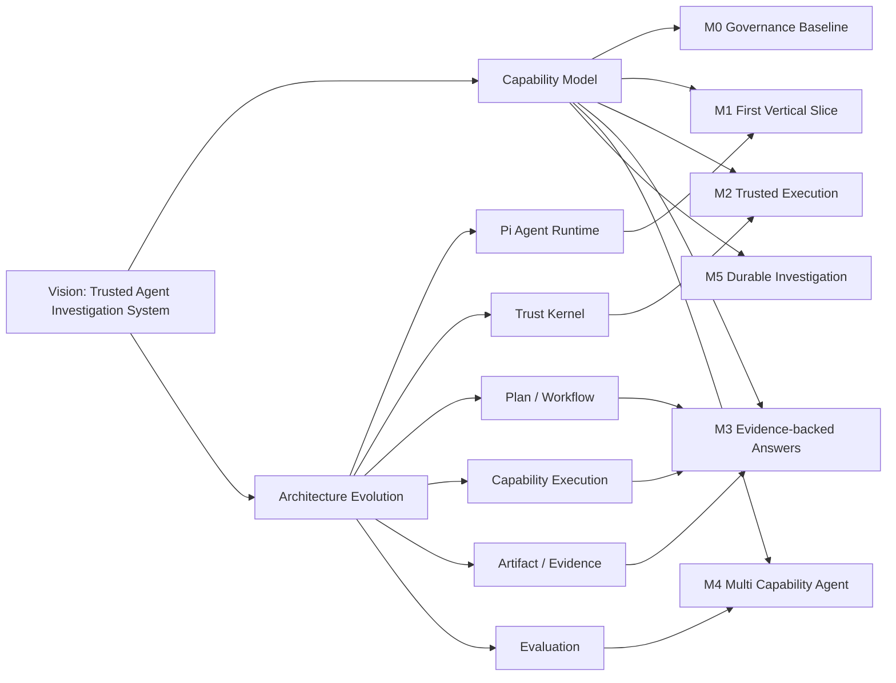

# Domeye Roadmap Visualization



## Release Thinking

Each milestone is a capability increment, not only an engineering milestone.

Example:

```
M1
Before:
Agent cannot complete a real end-to-end investigation.

After:
One bounded question can travel through:
Pi → Host → Capability → Tool → Artifact → Answer.
```

## Progress Interpretation

Green:
Capability verified.

Yellow:
Infrastructure exists but user journey is incomplete.

Red:
Design exists but implementation evidence is missing.

This avoids confusing architecture progress with product progress.
