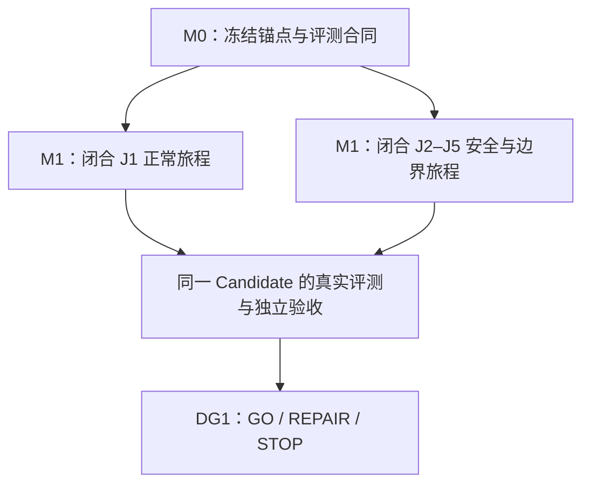

# Domeye Roadmap 视图

当前 Roadmap 只展开首个纵向切片。固定内容以
[锚点合同](../architecture/Domeye_First_Vertical_Slice_Anchor_v1.0.md)为准；具体工作范围见
[Epics](epics.md)与[Feature Breakdown](feature-breakdown.md)。

## 阶段结果

| 阶段 | 必须形成的结果 | 不能据此宣称 |
|---|---|---|
| M0 | 固定问题、身份、TOOL-03、OP-01、回答链、J1–J5、阈值与 Evidence 格式一致 | 文档落位不等于实现或验证 |
| M1：J1 | Pi 滚动提出下一 Action；Host 逐 Action 准入；真实 Tool/Operator 结果形成 Typed Finding 和安全 Answer | 单次演示不等于稳定性达标 |
| M1：J2–J5 | 拒绝、执行失败或回答越界时 fail-closed；J5 的并列极值、null 等边界输入按冻结合同产生确定性结果 | 测试数量不等于 Domain Evidence |
| 评测与验收 | 同一 Candidate 完成 J1 至少 30 次、J2–J5 全部预注册场景通过、Pass@1、Pass³、零容忍项和独立 Acceptance Record | PR 合并或 Issue Done 不等于 Verified |
| DG1 | 仅作 `GO / REPAIR / STOP` 决定 | Project Synced 不等于 Gate 通过 |

## 当前解释

首个纵向切片合同状态是 `Designed`。本视图不把后续 M2–M5、通用 Plan IR、预生成 DAG、
Claim 验证/发布体系或耐久工作流引擎预先列为承诺；DG1 之后再依据真实证据决定扩展。
